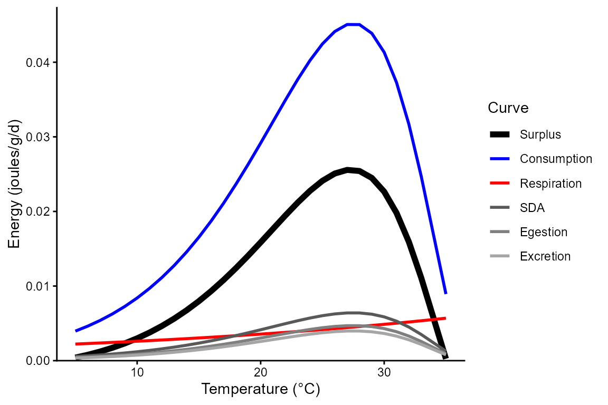
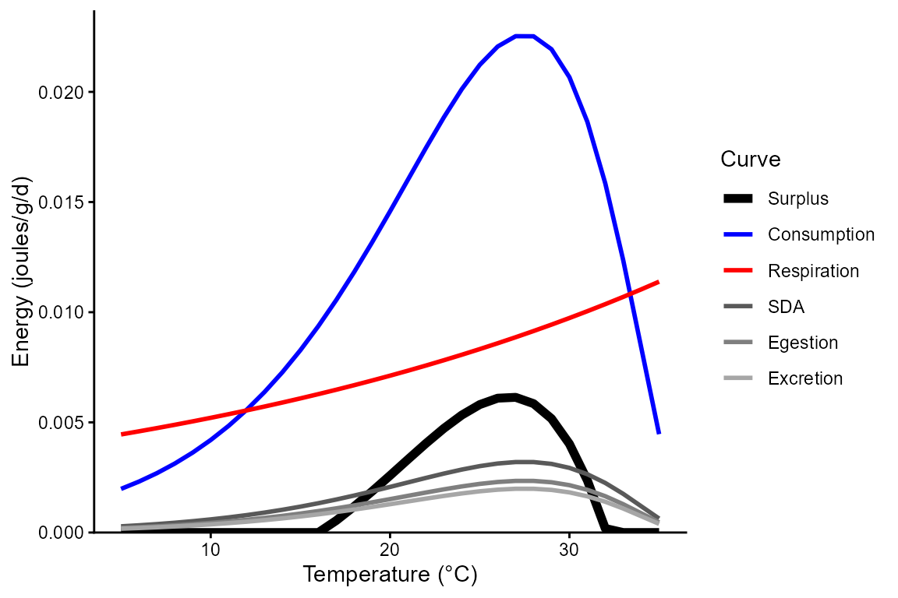
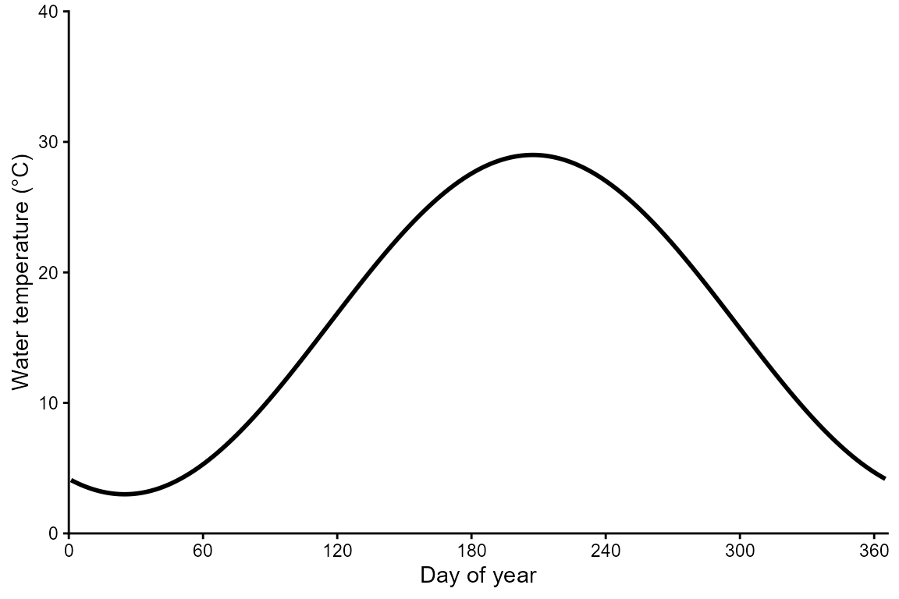
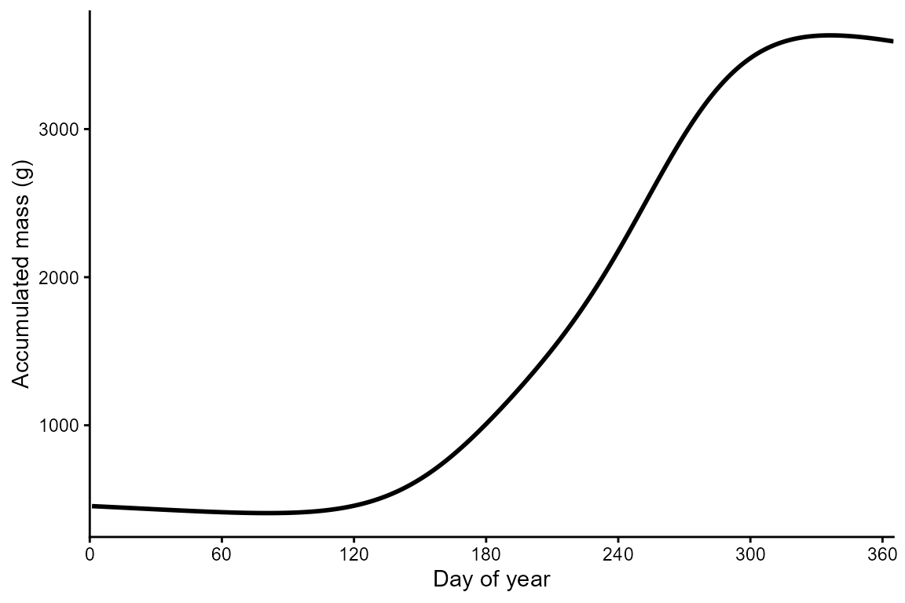
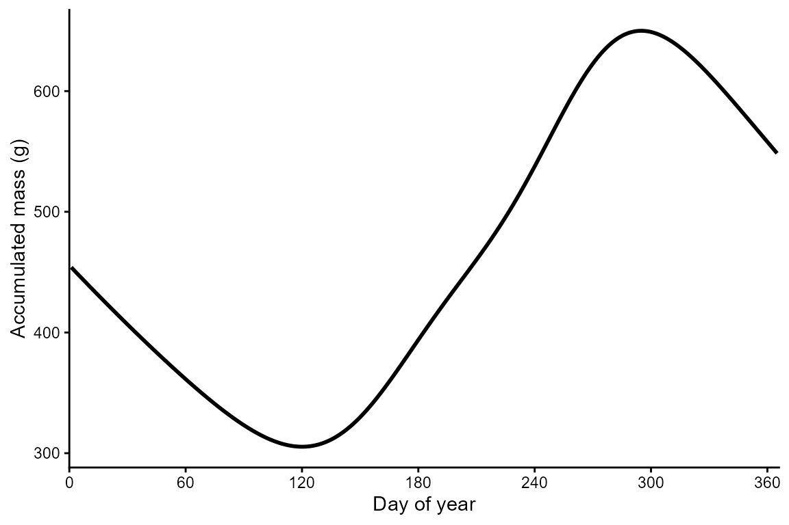
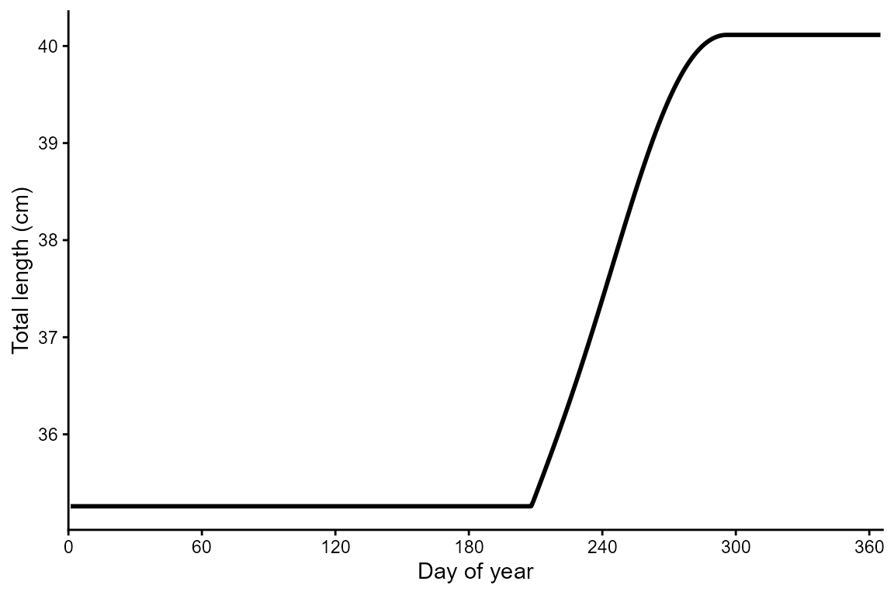
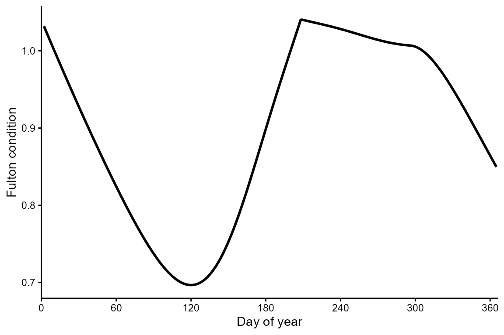

# Getting Started

### In this vignette, you will:

1.  Learn fundamentals of bioenergetics modeling (BEM) by visualizing
    mass dependent and temperature-dependent physiological rates.
2.  Simulate daily energetics and growth of a fish for a year.
3.  Explore effects of temporal extrinsic parameters like temperature,
    the proportion of maximum consumption (CP), the activity multiplier
    (ACT), and prey energy density.
4.  Compare energetics and growth among a representative warmwater and
    coldwater species.

##### 

First, install the fishyenergy package and load the library.
Dependencies include reshape2, stringr, terra, sf, lubridate, and
ggplot2. These libraries are automatically loaded.

``` r
setwd("D:\\UTSA_v01\\UTSA_research_v01\\project_BEM_package_v01\\fishyenergy\\")
devtools::load_all()
library(reshape2)
library(stringr)
library(terra)
library(sf)
library(lubridate)
library(ggplot2)
```

##### 

#### 1) Temperature-dependent physiological rates

Next, let’s look at temperature-dependent physiological rates of a few
species. Start by loading the intrinsic bioenergetics parameters of five
example species. These parameters have been published by various authors
since the 1980s and are available from Fish Bioenergetics 4.0 (FB4)

``` r
options(width = 500)
data(parms_fb4)
```

##### 

Let’s retain only one focal species, largemouth bass, and look at these
data.

``` r
options(width = 500)
parms.micsal <- parms_fb4[parms_fb4$genus_species == "micropterus_salmoides",]
parms.micsal
#>           genus_species LifeStage           Source    lwA   lwB CEQ   CA     CB   CQ  CTO CTM CTL CK1 CK4 REQ       RA     RB     RQ    RTO RTM RTL RK1 RK4     SDA    FA      UA pred_ED
#> 2 micropterus_salmoides     adult Rice et al. 1983 0.0226 2.781   2 0.33 -0.325 2.65 27.5  37  NA  NA  NA   1 0.008352 -0.355 0.0313 0.0196   0   0   1   0 0.15848 0.104 0.08817    4184
```

The first column shows the Latin name in snake case. Other columns like
lwA and lwB are the intercept and slope of the length-weight equation.
Still other columns like CA and CB are the intercept and slope of the
mass dependent consumption equation (a negative power law). There’s also
specific dynamic action (i.e., the proportion of energy consumed
allocated to the cost of digestion), predator energy density, and many
other variables defined by Hanson et al. (1997).

##### 

Let’s visualize the effect of temperature on consumption, respiration,
and various other physiological rates for largemouth bass. To do this,
we use the bem_curve function which needs to be supplied with a few
essential arguments.

Set the mass to a reasonable amount (454 grams which is ~ 1 pound).

We plot this curve over ecologically realistic temperature range of 5°C
to 35°C.

We specify the intrinsic parameters for largemouth bass and the
corresponding consumption and respiration functions… 2 and 1,
respectively.

``` r
bem_curve(M = 454,
          T = 5:35,
          CP = 1.0,
          ACT = 1.0,
          prey_ED = 4000,
          parms.intrinsic = parms.micsal,
          C_eq = 2,
          R_eq = 1)
```


Notice that the consumption curve increases exponentially to an optimum
temperature of ~28°C and then declines at higher temperatures. This
curve shape is characteristic of consumption function 2. In contrast, we
see that the respiration curve increases exponentially over the full
range of temperatures (i.e., there is no optimum beyond which
respiration declines). This curve shape is characteristic of respiration
function 1.

Compare the above curves to those plotted when the activity multiplier
is changed from 1.0 to 2.0, thus simulating a predator fish with 2 times
the metabolic demand of the previous predator fish at rest. Notice that
the red respiration curve is higher and consequently the black surplus
curve is lower.

``` r
bem_curve(M = 454,
          T = 5:35,
          CP = 1.0,
          ACT = 2.0,
          prey_ED = 4000,
          parms.intrinsic = parms.micsal,
          C_eq = 2,
          R_eq = 1)
```



##### 

It is clear that largemouth bass perform well at higher temperatures
which is why we know them to be members of the warmwater thermal guild.
Let’s visualize the effect of temperature on the same physiological
rates for a putative coldwater species, the brook trout. Notice that the
consumption and respiration equations for brook trout are 2 and 2,
respectively.

``` r
bem_curve(M = 454,
          T = 5:35,
          CP = 1.0,
          ACT = 1.0,
          prey_ED = 4000,
          parms.intrinsic = parms_fb4[parms_fb4$genus_species == "salvelinus_fontinalis",],
          C_eq = 2,
          R_eq = 2)
```



##### 

#### 2) Grow a fish!

First, simulate (i.e., create a fake) temperature time series with mean
daily water temperature for every day of a calendar year. We do this
using a sine wave function, setting mean annual temperature and annual
amplitude to values that are realistic for a temperate waterbody that
does not ice over during the winter.

``` r
parm.tmean <- 16        # mean annual temperature
parm.ampli <- 13        # temperature amplitude
julian <- seq(1,365,1)
WT_mean <- parm.ampli * sin((2*(pi/365)) * julian - 2) + parm.tmean
temps_fake <- data.frame(julian, WT_mean)
```

Plot the time series of mean daily water temperature.

``` r
ggplot(NULL) + theme_classic() +
  labs(x = "Day of year", y = "Water temperature (°C)") +
  scale_x_continuous(expand = c(0,0), limits = c(0,366), breaks = seq(0, 360, 60)) + 
  scale_y_continuous(expand = c(0,0), limits = c(0,40), breaks = seq(0, 40, 10)) + 
  geom_line(aes(x = julian, y = WT_mean), temps_fake, linewidth = 1)
```



##### 

Next, use the bem_grow function to simulate the daily bioenergetic
budget of a largemouth bass. We need to load some parameters that
potentially vary temporally. The dataframe has 365 rows representing
each day of the year. There are five noteworthy columns (i.e.,
variables):

CP is the proportion of maximum consumption and decrease as prey
quantity declines or as exploitative competition increases.

ACT is the activity multiplier where a value of zero would indicate no
metabolic costs beyond being at rest. Maintaining position in a flowing
stream, avoiding predators, pursuing prey, and engaging in reproductive
behavior increase ACT.

The next two parameters (gsi_f and gsi_m) allow the user to model
somatic growth of a reproductively mature fish that allocates some
energy to gonadal tissue. Separate parameters are provided for females
and males because the sexes invest different amounts of energy to their
gonads–gsi_f and gsi_m, respectively. The default data assume a
reproductively immature fish (i.e., gsi = 0).

Modifying prey energy density (prey_ED) over the year can simulate
ontogenetic diet shifts or changes in prey quality. There are numerous
published estimates of prey energy density for common prey items like
invertebrates, fish, and so on.

``` r
options(width = 500)
data(parms_temporal_DEFAULT)
dim(parms_temporal_DEFAULT)
#> [1] 365   6
head(parms_temporal_DEFAULT)
#>       date CP ACT gsi_f gsi_m prey_ED
#> 1 1/1/2025  1   1     0     0    3698
#> 2 1/2/2025  1   1     0     0    3698
#> 3 1/3/2025  1   1     0     0    3698
#> 4 1/4/2025  1   1     0     0    3698
#> 5 1/5/2025  1   1     0     0    3698
#> 6 1/6/2025  1   1     0     0    3698
```

##### 

Next, use the bem_grow function to simulate the daily bioenergetic
budget of a largemouth bass. Start the fish at 454 grams which is ~1
pound. We need to load some parameters that potentially vary temporally.

``` r
grow.micsal <- bem_grow(start_M2 = 454,
                        temperature = temps_fake,
                        parms.intrinsic = parms.micsal,
                        parms.temporal = parms_temporal_DEFAULT,
                        C_eq = 2,
                        R_eq = 1)
```

##### 

The output of bem_grow is quite extensive. There are 365 rows
representing each day of the year and 43(!) variables. Let’s have a look
at those variables:

The first eight variables represent inputs that you’re already familiar
with like temperature, CP, ACT, gsi, and so on.

The remaining variables are outputs including consumption (C),
respiration (R), egestion (F), excretion (U), specific dynamic action
(SDA), somatic mass (MS), and gonadal mass for females and males (MG).

The “1” version of these variables are in units of energy (joules) and
the “2” version of these variables are in units of mass (grams). The
“\_ins” version of these variables represents instantaneous (i.e.,
daily) values and the “\_cum” represents cumulative values (i.e., since
January 1st).

Finally, cumulative length (L_cum) and Fulton condition factor (K) are
calculated from the length-weight parameters in parms_fb4. Survival
(Surv) is assumed to start at 1 on January 1st and remains 1 if Fulton
condition factor remains at or above 0.4 but switches to 0 if K falls
below 0.4.

``` r
options(width = 500)
head(grow.micsal)
#>   julian WT_mean pred_ED gsi_m gsi_f CP ACT prey_ED C1_ins   C2_ins R1_ins   R2_ins F1_ins  F2_ins U1_ins  U2_ins SDA1_ins SDA2_ins   MS1_ins MS2_ins MG1_ins MG2_ins    M1_ins M2_ins C1_cum    C2_cum R1_cum    R2_cum F1_cum   F2_cum U1_cum   U2_cum SDA1_cum SDA2_cum    MS1_cum MS2_cum MG1_cum MG2_cum     M1_cum  M2_cum   L_cum        K Surv
#> 1      1     4.1    4184     0     0  1   1    3698  0.000    0.000  0.000    0.000  0.000   0.000  0.000   0.000    0.000    0.000     0.000   0.000       0       0     0.000  0.000  0.000     0.000  0.000     0.000  0.000    0.000  0.000    0.000    0.000    0.000      0.000 454.000       0       0      0.000 454.000 35.2587       NA   NA
#> 2      2     4.0    4184     0     0  1   1    3698  1.537 5682.363  0.490 6640.852  0.160 590.966  0.135 501.014    0.218  806.885 -2857.354  -0.683       0       0 -2857.354 -0.683  1.537  5682.363  0.490  6640.852  0.160  590.966  0.135  501.014    0.218  806.885  -2857.354 453.317       0       0  -2857.354 453.317 35.2587 1.034197    1
#> 3      3     3.9    4184     0     0  1   1    3698  1.515 5601.397  0.488 6616.928  0.158 582.545  0.134 493.875    0.215  795.388 -2887.338  -0.690       0       0 -2887.338 -0.690  3.051 11283.760  0.978 13257.779  0.317 1173.511  0.269  994.889    0.433 1602.272  -5744.692 452.627       0       0  -5744.692 452.627 35.2587 1.032623    1
#> 4      4     3.8    4184     0     0  1   1    3698  1.494 5524.576  0.486 6593.751  0.155 574.556  0.132 487.102    0.212  784.479 -2915.312  -0.697       0       0 -2915.312 -0.697  4.545 16808.336  1.464 19851.531  0.473 1748.067  0.401 1481.991    0.645 2386.751  -8660.004 451.930       0       0  -8660.004 451.930 35.2587 1.031033    1
#> 5      5     3.8    4184     0     0  1   1    3698  1.474 5451.794  0.485 6571.325  0.153 566.987  0.130 480.685    0.209  774.144 -2941.347  -0.703       0       0 -2941.347 -0.703  6.020 22260.130  1.949 26422.856  0.626 2315.054  0.531 1962.676    0.855 3160.896 -11601.351 451.227       0       0 -11601.351 451.227 35.2587 1.029429    1
#> 6      6     3.7    4184     0     0  1   1    3698  1.456 5382.949  0.483 6549.651  0.151 559.827  0.128 474.615    0.207  764.368 -2965.511  -0.709       0       0 -2965.511 -0.709  7.475 27643.079  2.432 32972.507  0.777 2874.880  0.659 2437.290    1.061 3925.264 -14566.863 450.518       0       0 -14566.863 450.518 35.2587 1.027812    1
```

##### 

Plot the time series of m2_cum. This is the cumulative mass of the
predator fish in grams. Notice that our largemouth bass does most of its
growing during the warm summer months which makes sense for this
warmwater species. What doesn’t make sense is that this fish starts the
year at 454 grams (~1 pound) and ends the year at a whopping 3,592 grams
(7.9 pounds)!

This is because we unrealistically have assumed the predator fish has
limitless food (CP = 1), sets up shop in one place and never moves (ACT
= 1), and allocates no energy to reproduction (gsi\_ = 0).

The bem_validate function provides a means of estimating
difficult-to-measure parameters like CP and ACT using field- or
lab-derived measurements of length-at-age to identify pairs of CP and
ACT values that result in realistic end-of-year mass. See the Validation
vignette to learn this workflow.

``` r
ggplot(NULL) + theme_classic() +
    labs(x = "Day of year", y = "Accumulated mass (g)") +
    scale_x_continuous(expand = c(0,0), limits = c(0,365), breaks = seq(0,360,60)) +
    geom_line(aes(x = julian, y = M2_cum), grow.micsal, linewidth = 1)
```



##### 

To better visualize this summer growth, plot m2_ins. The horizontal red
line is at y = 0, meaning that the predator fish has an energy deficit
below this line (winter) and an energy surplus above this line (summer).

``` r
ggplot(NULL) + theme_classic() +
  labs(x = "Day of year", y = "Daily mass change (g)") +
  scale_x_continuous(expand = c(0,0), limits = c(0,366), breaks = seq(0, 360, 60)) +
  geom_hline(yintercept = 0, color = "red") +
  geom_line(aes(x = julian, y = M2_ins), grow.micsal, linewidth = 1)
```


Let’s manually adjust CP and ACT to see how it affects growth. If dig
into the literature, CP values are often around 0.6 and ACT values are
often around 1.4. Change these values in the parms_temporal_DEFAULT
dataframe, re-run the bem_grow function, and then re-plot growth. It
seems reasonable that a 454 gram fish would grow to 548 grams in a
year–that is, from 1.0 pounds to 1.2 pounds.

``` r
parms_temporal_DEFAULT$CP <- 0.6
parms_temporal_DEFAULT$ACT <- 1.4

grow.micsal.real <- bem_grow(start_M2 = 454,
                             temperature = temps_fake,
                             parms.intrinsic = parms.micsal,
                             parms.temporal = parms_temporal_DEFAULT,
                             C_eq = 2,
                             R_eq = 1)
ggplot(NULL) + theme_classic() +
  labs(x = "Day of year", y = "Accumulated mass (g)") +
  scale_x_continuous(expand = c(0,0), limits = c(0,366), breaks = seq(0, 360, 60)) +
  geom_line(aes(x = julian, y = M2_cum), grow.micsal.real, linewidth = 1)
```



Finally, let’s look at how mass, length, and condition change over time.
Bioenergetics models are biologically realistic in that they simulate
daily energy balance–that is, either deficits or surpluses. Mass can
decrease or increase over time whereas length can increase with energy
surpluses but cannot realistically decrease when there are energy
deficits. The bem_grow function uses this axiom to simulate changes in
Fulton condition factor over time as demonstrated below:

The previous plot shows that the mass of the predator fish starts at 454
grams on January 1st and decreases for 120 (until ~April). The predator
fish then grows in both mass and length until day 290 (~October). Plot
length (cm) over time to see how length does not change during periods
of energy deficit and increases when there is an energy surplus.

``` r
ggplot(NULL) + theme_classic() +
  labs(x = "Day of year", y = "Total length (cm)") +
  scale_x_continuous(expand = c(0,0), limits = c(0,366), breaks = seq(0, 360, 60)) +
  geom_line(aes(x = julian, y = L_cum), grow.micsal.real, linewidth = 1)
```



When mass decreases and length stays the same, Fulton condition should
decrease.

``` r
ggplot(NULL) + theme_classic() +
  labs(x = "Day of year", y = "Fulton condition") +
  scale_x_continuous(expand = c(0,0), limits = c(0,366), breaks = seq(0, 360, 60)) +
  geom_line(aes(x = julian, y = K), grow.micsal.real, linewidth = 1)
```


