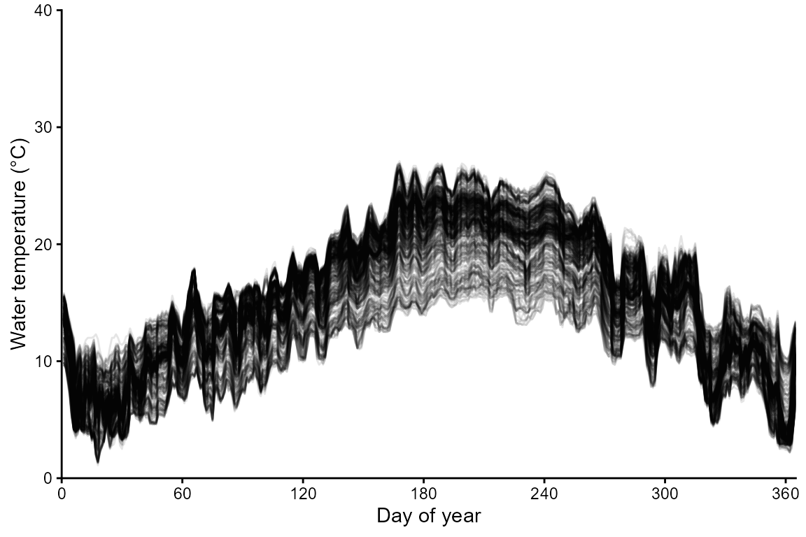
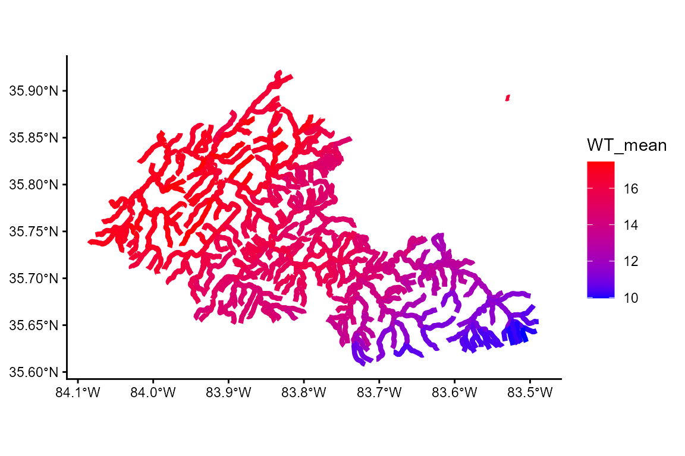
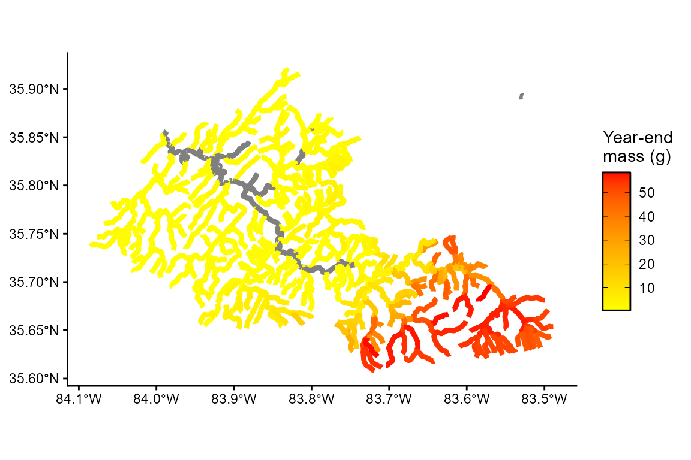
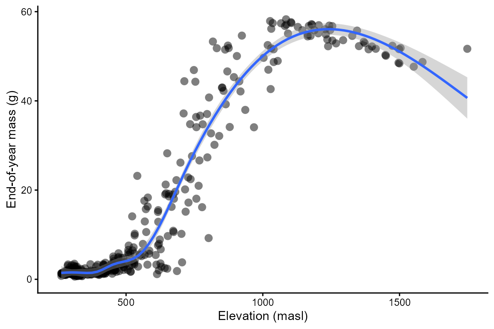
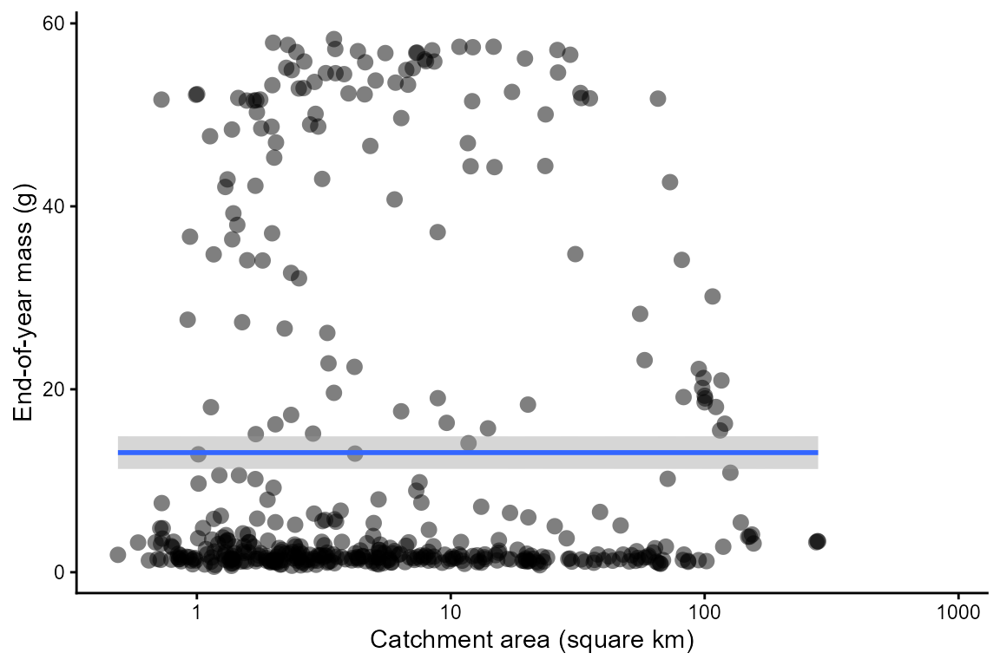

# Mapping Brook trout

### In this vignette, you will:

1.  Explore spatial variation in the performance of Brook trout
    (Salvelinus fontinalis) in interconfluence stream reaches of the
    Little River watershed, a tributary of the upper Tennessee River
    system that drains the Blue Ridge Mountains and Great Smoky
    Mountains National Park in Tennessee, USA.
2.  Use bioenergetics modeling to simulate individual performance
    metrics across 513 interconfluence stream reaches (lotic habitat
    patches).
3.  Create maps showing spatially-contiguous variation in these
    performance metrics and drivers of this spatial variation (e.g.,
    temperature).

##### 

First, install the fishyenergy package and load the library.
Dependencies include reshape2, stringr, terra, sf, lubridate, and
ggplot2. These libraries are automatically loaded.

``` r
setwd("D:\\UTSA_v01\\UTSA_research_v01\\project_BEM_package_v01\\fishyenergy\\")
devtools::load_all()
library(reshape2)
library(stringr)
library(terra)
library(sf)
library(lubridate)
library(ggplot2)
```

##### 

Next, load the intrinsic bioenergetics parameters of five example
species. These parameters have been published by various authors since
the 1980s and are available from Fish Bioenergetics 4.0 (FB4).

``` r
data(parms_fb4)
```

##### 

Let’s retain only one focal species, Brook trout, and look at these
data.

``` r
options(width = 500)
parms.salfon <- parms_fb4[parms_fb4$genus_species == "salvelinus_fontinalis",]
parms.salfon
#>           genus_species      LifeStage                                                                         Source     lwA  lwB CEQ     CA      CB    CQ CTO CTM CTL CK1 CK4 REQ     RA     RB  RQ  RTO RTM RTL RK1 RK4   SDA    FA     UA pred_ED
#> 5 salvelinus_fontinalis juvenile_adult Troia modified from: Elliot 1976; Hartman and Sweka 2003; Hartman and Cox 2008 0.00881 3.04   2 0.3013 -0.3055 7.274  17  21  NA  NA  NA   2 0.0132 -0.265 4.5 20.2  25  NA  NA  NA 0.172 0.212 0.0314    4162
```

The first column shows the Latin name in snake case. Other columns like
lwA and lwB are the intercept and slope of the length-weight equation.
Still other columns like CA and CB are the intercept and slope of the
mass dependent consumption equation (a negative power law). There’s also
specific dynamic action (i.e., the proportion of energy consumed
allocated to the cost of digestion), predator energy density, and many
other variables defined by Hanson et al. (1997).

##### 

Next, we need to load some parameters that potentially vary temporally.
The dataframe has 365 rows representing each day of the year. There are
five noteworthy columns (i.e., variables):

CP is the proportion of maximum consumption and decrease as prey
quantity declines or as exploitative competition increases.

ACT is the activity multiplier where a value of zero would indicate no
metabolic costs beyond being at rest. Maintaining position in a flowing
stream, avoiding predators, pursuing prey, and engaging in reproductive
behavior increase ACT.

The next two parameters (gsi_f and gsi_m) allow the user to model
somatic growth of a reproductively mature fish that allocates some
energy to gonadal tissue. Separate parameters are provided for females
and males because the sexes invest different amounts of energy to their
gonads–gsi_f and gsi_m, respectively. The default data assume a
reproductively immature fish (i.e., gsi = 0).

Modifying prey energy density (prey_ED) over the year can simulate
ontogenetic diet shifts or changes in prey quality. There are numerous
published estimates of prey energy density for common prey items like
invertebrates, fish, and so on.

``` r
options(width = 500)
data(parms_temporal_DEFAULT)
dim(parms_temporal_DEFAULT)
#> [1] 365   6
head(parms_temporal_DEFAULT)
#>       date CP ACT gsi_f gsi_m prey_ED
#> 1 1/1/2025  1   1     0     0    3698
#> 2 1/2/2025  1   1     0     0    3698
#> 3 1/3/2025  1   1     0     0    3698
#> 4 1/4/2025  1   1     0     0    3698
#> 5 1/5/2025  1   1     0     0    3698
#> 6 1/6/2025  1   1     0     0    3698
```

##### 

Let’s modify CP and ACT to more realistic values. Specifically, we will
use CP = 0.50 and ACT = 1.60 These parameter values were validated
behind the scenes using the bem_validate function. See the Validation
vignette for details.

``` r
options(width = 500)
parms_temporal_DEFAULT$CP = 0.50
parms_temporal_DEFAULT$ACT = 1.60
head(parms_temporal_DEFAULT)
#>       date  CP ACT gsi_f gsi_m prey_ED
#> 1 1/1/2025 0.5 1.6     0     0    3698
#> 2 1/2/2025 0.5 1.6     0     0    3698
#> 3 1/3/2025 0.5 1.6     0     0    3698
#> 4 1/4/2025 0.5 1.6     0     0    3698
#> 5 1/5/2025 0.5 1.6     0     0    3698
#> 6 1/6/2025 0.5 1.6     0     0    3698
```

##### 

Let’s explore some stream temperature data produced by
Herrera-Rodriguez, Giam, Troia, and others as part of a Southeastern
Climate Adaptation Science Center (CASC) project. This dataset provides
daily mean temperatures for 76,553 interconfluence stream segments in
the Tennessee and Cumberland River systems for every year from 1982 to
2022. These segments represent those of the National Stream Internet
(NSI; modified from the National Hydrography Dataset) and so include
some geographic (e.g., elevation above sea level) and hydrographic
(e.g., catchment area) covariates for these segments. In fishyenergy, we
have extracted daily temperatures in 2022 and covariates for 513
interconfluence stream segments in the Little River watershed. Let’s
load this dataset called temps_casc in fishyenergy.

The dataset has 513 rows each representing a different interconfluence
stream segment and 366 columns representing the unique segment ID
(COMID) followed by the 365 julian days.

``` r
options(width = 2000)
data(temps_casc)
dim(temps_casc)
#> [1] 513 366
head(temps_casc[,1:91])
#>           COMID julian001 julian002 julian003 julian004 julian005 julian006 julian007 julian008 julian009 julian010 julian011 julian012 julian013 julian014 julian015 julian016 julian017 julian018 julian019 julian020 julian021 julian022 julian023 julian024 julian025 julian026 julian027 julian028 julian029 julian030 julian031 julian032 julian033 julian034 julian035 julian036 julian037 julian038 julian039 julian040 julian041 julian042 julian043 julian044 julian045 julian046 julian047 julian048 julian049 julian050 julian051 julian052 julian053 julian054 julian055 julian056 julian057 julian058 julian059 julian060 julian061 julian062 julian063 julian064 julian065 julian066 julian067 julian068 julian069 julian070 julian071 julian072 julian073 julian074 julian075 julian076 julian077 julian078 julian079 julian080 julian081 julian082 julian083 julian084 julian085 julian086 julian087 julian088 julian089 julian090
#> 1 COMID22130003      14.0      13.6      11.8      10.4      10.0       7.8       5.9       5.9       7.1       6.0       6.3       7.6       7.4       6.6       7.4       8.0       6.0       5.9       6.9       6.9       6.4       6.4       6.8       6.2       6.4       6.5       7.2       7.0       6.2       5.7       6.7       7.5       8.0       9.9       9.4       8.6       8.2       8.5       7.7       8.3       8.9      10.2      10.8      10.4      10.0      10.5      10.7      10.8      10.9      10.9      11.1      11.2      11.2      12.8      13.7      13.3      11.5      10.8      10.4      10.4      10.9      12.5      14.3      14.8      15.3      15.6      14.6      14.0      13.3      12.5      11.1      11.2      11.0      11.3      11.4      13.4      14.1      14.0      13.8      14.1      14.3      14.9      15.3      14.7      14.4      12.5      12.9      12.9      13.8      14.7
#> 2 COMID22130007      14.0      13.4      11.9      10.9      10.2       7.7       6.3       6.4       7.0       6.2       6.2       7.7       7.5       6.9       7.5       8.1       6.0       6.0       7.3       7.4       6.8       7.1       7.1       6.4       6.5       6.8       7.3       7.5       6.4       6.3       7.0       8.1       8.2      10.5       9.6       8.9       8.4       8.6       8.0       8.6       8.9      10.7      11.1      11.0      10.5      11.1      11.2      11.2      11.2      11.4      11.5      11.4      11.6      13.0      13.9      13.2      12.0      11.2      10.4      10.5      11.6      12.6      14.2      15.0      15.2      15.7      14.6      14.2      13.5      12.7      11.4      11.3      11.2      11.8      11.9      13.5      14.4      14.1      14.1      14.2      14.7      15.0      15.1      14.8      14.6      13.2      13.3      13.4      13.8      15.0
#> 3 COMID22130025      14.3      13.4      11.9      11.1      10.2       8.0       6.5       7.2       7.6       6.8       7.0       7.8       7.9       7.2       8.0       8.8       6.4       6.5       8.0       7.9       7.0       7.5       7.6       6.8       6.8       7.1       7.7       7.8       6.8       6.5       7.4       8.3       8.0      10.3       9.4       8.7       8.3       8.6       8.0       8.8       8.9      10.7      10.9      11.0      10.5      11.0      11.1      11.1      11.0      11.3      11.4      11.5      11.5      13.0      13.7      13.4      12.0      11.2      10.7      10.6      11.4      12.6      14.2      15.1      15.6      15.8      14.8      14.2      13.4      12.5      11.6      11.2      11.4      11.7      11.7      13.6      14.2      13.8      13.9      14.2      14.4      15.1      15.2      14.7      14.5      12.8      12.8      12.7      13.8      14.7
#> 4 COMID22130027      14.1      13.5      12.2      11.1      10.1       7.7       6.3       6.5       7.3       6.5       6.7       7.8       7.8       7.4       7.9       8.4       6.1       6.4       7.8       7.6       7.0       7.4       7.5       6.7       6.6       7.1       7.8       7.9       7.0       7.0       7.6       8.4       8.4      10.7       9.7       9.0       8.5       8.7       8.2       8.6       8.9      10.8      11.0      11.0      10.6      11.3      11.3      11.2      11.4      11.5      11.8      11.7      11.9      13.2      14.0      13.4      12.2      11.6      10.7      10.8      11.7      12.8      14.3      14.9      15.2      15.5      14.6      14.4      13.4      12.9      11.7      11.4      11.4      12.1      12.6      13.5      14.3      14.0      14.1      14.3      14.6      15.0      15.0      14.8      14.5      13.0      13.7      13.7      13.9      15.0
#> 5 COMID22130031      14.1      13.4      12.2      11.1      10.2       7.7       6.6       6.7       7.4       6.6       6.8       7.8       7.9       7.5       8.0       8.4       6.3       6.8       7.9       7.7       7.0       7.4       7.5       6.8       6.8       7.1       8.0       8.1       7.1       7.2       7.7       8.6       8.4      10.8       9.7       8.9       8.5       8.6       8.2       8.5       8.9      10.7      11.0      10.9      10.5      11.1      11.2      11.2      11.3      11.5      11.7      11.5      11.7      13.2      14.0      13.3      12.1      11.4      10.6      10.7      11.6      12.7      14.3      14.9      15.2      15.5      14.6      14.3      13.3      12.8      11.6      11.3      11.3      11.9      12.4      13.4      14.3      14.0      14.1      14.3      14.7      15.0      15.0      14.7      14.4      13.0      13.4      13.4      13.8      14.9
#> 6 COMID22130033      14.8      13.8      12.8      11.8      10.8       8.9       7.4       7.9       8.4       7.8       8.1       8.9       8.9       8.5       9.0       9.5       7.7       8.1       9.0       8.6       7.8       8.2       8.4       8.0       8.0       8.2       9.0       9.3       8.2       8.1       8.8       9.7       9.3      11.4      10.3       9.6       9.2       9.4       8.8       9.4       9.6      11.5      11.7      11.7      11.4      12.0      11.8      11.9      11.9      12.1      12.2      12.1      12.2      13.6      14.4      13.7      12.8      12.1      11.1      11.1      12.4      13.5      14.8      15.2      15.6      15.8      14.9      14.8      13.8      13.3      12.3      12.0      11.9      12.5      12.7      14.4      14.7      14.5      14.6      14.7      14.9      15.3      15.4      15.2      14.9      13.5      13.6      13.5      14.6      15.5
```

##### 

Let’s visualize the spatial and temporal variation in these temperature
data. Each line is one of the 513 interconfluence stream segments.

``` r
temps_casc.long <- melt(temps_casc, id.vars = "COMID", value.name = "WT_mean")
temps_casc.long$date <- as.numeric(gsub("julian","", temps_casc.long$variable))
ggplot(NULL) + theme_classic() + theme(legend.position = "none") +
    labs(x = "Day of year", y = "Water temperature (°C)") +
    scale_x_continuous(expand = c(0,0), limits = c(0,365), breaks = seq(0,360,60)) +
    scale_y_continuous(expand = c(0,0), limits = c(0,40), breaks = seq(0,40,10)) +
    geom_line(aes(x = date, y = WT_mean, group = COMID), temps_casc.long, linewidth = 0.5, alpha = 0.1)
```



##### 

Let’s map the spatial variation in temperature.

``` r
temps_casc.mean <- aggregate(WT_mean ~ COMID, temps_casc.long, FUN = mean)

data(envir_casc)

vect.temps_casc.mean <- merge(x = envir_casc, y = temps_casc.mean, by = "COMID")

ggplot(NULL) + theme_classic() +
  scale_color_gradient(low = "blue", high = "red") +
  geom_sf(aes(color = WT_mean), data = vect.temps_casc.mean, size = 1.5, shape = 16)
```



##### 

Run the bem_project function to grow a fish for n habitat patches. Be
sure to set the is.raster argument to FALSE because the temperature
input is in tabular form and not raster.

``` r
output.casc <- bem_project(start_M2 = 13,
                           temperature = temps_casc,
                           parms.intrinsic = parms.salfon,
                           parms.temporal = parms_temporal_DEFAULT,
                           C_eq = 2,
                           R_eq = 2,
                           is.raster = FALSE)
```

##### 

Output from bem_project is a list of length three.

1.  The first list element is the run time. The bem_project function,
    like the bem_validate function, takes some time to run and that time
    increases with the number of habitat patches.

``` r
output.casc$run.time
#> [1] "Run time is 3.13 minutes for 513 habitat patches"
```

2.  The last two outputs are tabular. The first, year.end.perform, has a
    number of rows equal to the number of habitat patches. There are two
    columns representing the habitat patch ID and the simulated
    end-of-year mass (M2_cum).

``` r
options(width = 500)
head(output.casc$year.end.perform)
#>         patchID M2_cum
#> 1 COMID22130003  0.833
#> 2 COMID22130007  0.820
#> 3 COMID22130025  0.921
#> 4 COMID22130027  1.148
#> 5 COMID22130031  0.802
#> 6 COMID22130033  0.855
```

3.  The other tabular output, daily.output, is a list with a number of
    elements equal to the number of habitat patches. Each element is
    dataframe with the same 365 rows and 43 columns produced by the
    bem_grow function.

``` r
options(width = 500)
head(output.casc$daily.output[[1]])
#>        date WT_mean pred_ED gsi_m gsi_f  CP ACT prey_ED C1_ins   C2_ins R1_ins  R2_ins F1_ins  F2_ins U1_ins U2_ins SDA1_ins SDA2_ins MS1_ins MS2_ins MG1_ins MG2_ins  M1_ins M2_ins C1_cum   C2_cum R1_cum   R2_cum F1_cum   F2_cum U1_cum  U2_cum SDA1_cum SDA2_cum  MS1_cum MS2_cum MG1_cum MG2_cum   M1_cum M2_cum    L_cum         K Surv
#> 1 julian001    14.0    4162     0     0 0.5 1.6    3698  0.000    0.000  0.000   0.000  0.000   0.000  0.000  0.000    0.000    0.000   0.000   0.000       0       0   0.000  0.000  0.000    0.000  0.000    0.000  0.000    0.000  0.000   0.000    0.000    0.000    0.000  13.000       0       0    0.000 13.000 11.02614        NA   NA
#> 2 julian002    13.6    4162     0     0 0.5 1.6    3698  0.629 2324.943  0.070 948.823  0.133 492.888  0.020 73.003    0.085  315.114 495.116   0.119       0       0 495.116  0.119  0.629 2324.943  0.070  948.823  0.133  492.888  0.020  73.003    0.085  315.114  495.116  13.119       0       0  495.116 13.119 11.02614 0.9786535    1
#> 3 julian003    11.8    4162     0     0 0.5 1.6    3698  0.446 1650.661  0.052 702.113  0.095 349.940  0.014 51.831    0.060  223.724 323.053   0.078       0       0 323.053  0.078  1.075 3975.604  0.122 1650.936  0.228  842.828  0.034 124.834    0.146  538.837  818.169  13.197       0       0  818.169 13.197 11.05923 0.9756339    1
#> 4 julian004    10.4    4162     0     0 0.5 1.6    3698  0.328 1212.109  0.040 545.223  0.069 256.967  0.010 38.060    0.044  164.284 207.574   0.050       0       0 207.574  0.050  1.403 5187.713  0.162 2196.158  0.297 1099.795  0.044 162.894    0.190  703.122 1025.743  13.246       0       0 1025.743 13.246 11.08071 0.9736365    1
#> 5 julian005    10.0    4162     0     0 0.5 1.6    3698  0.299 1105.642  0.037 506.782  0.063 234.396  0.009 34.717    0.041  149.854 179.892   0.043       0       0 179.892  0.043  1.702 6293.355  0.199 2702.941  0.361 1334.191  0.053 197.611    0.231  852.976 1205.635  13.290       0       0 1205.635 13.290 11.09447 0.9731840    1
#> 6 julian006     7.8    4162     0     0 0.5 1.6    3698  0.173  637.939  0.024 329.378  0.037 135.243  0.005 20.031    0.023   86.464  66.823   0.016       0       0  66.823  0.016  1.874 6931.294  0.224 3032.319  0.397 1469.434  0.059 217.643    0.254  939.440 1272.458  13.306       0       0 1272.458 13.306 11.10636 0.9712324    1
```

##### 

Mapping simulated performance across habitat patches.

``` r
perf.casc <- output.casc$year.end.perform
colnames(perf.casc) <- c("COMID", "M2_cum")

vect.perf.casc <- merge(x = envir_casc, y = perf.casc, by = "COMID")

ggplot(NULL) + theme_classic() +
  scale_colour_gradient("Year-end\nmass (g)",
                        low = "yellow", high = "red",
                        guide = guide_colorbar(frame.colour = "black", ticks.colour = "black")) +
  geom_sf(aes(color = M2_cum), data = vect.perf.casc, size = 1.5, shape = 16)
```



##### 

What is the relationship between environmental variables and brook trout
performance? Let’s plot and see. Each point represents a different
interconfluence stream reach in the Little River watershed.

``` r
ggplot(NULL) + theme_classic() + theme(legend.position = "none") +
    labs(x = "Elevation (masl)", y = "End-of-year mass (g)") +
    geom_point(aes(x = ElevCat, y = M2_cum), vect.perf.casc, shape = 16, size = 3, alpha = 0.5) +
    geom_smooth(aes(x = ElevCat, y = M2_cum), vect.perf.casc, method = "gam")
```



``` r

ggplot(NULL) + theme_classic() + theme(legend.position = "none") +
    labs(x = "Catchment area (square km)", y = "End-of-year mass (g)") +
    scale_x_log10() +
    geom_point(aes(x = TotDASqKM, y = M2_cum), vect.perf.casc, shape = 16, size = 3, alpha = 0.5) +
    geom_smooth(aes(x = TotDASqKM, y = M2_cum), vect.perf.casc, method = "gam")
```


