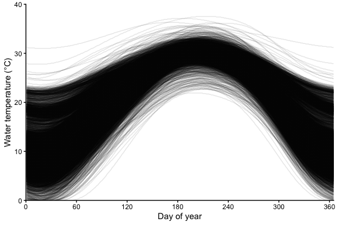
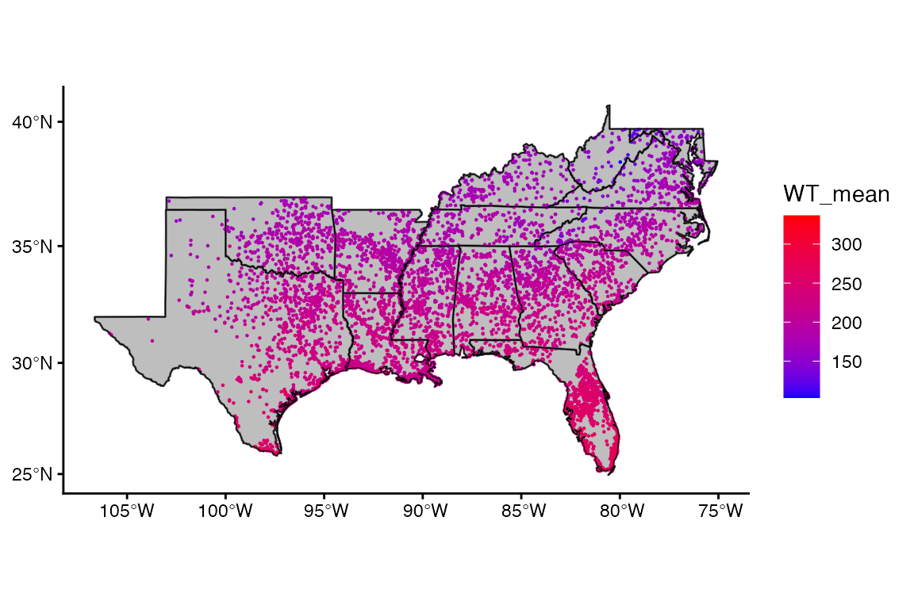
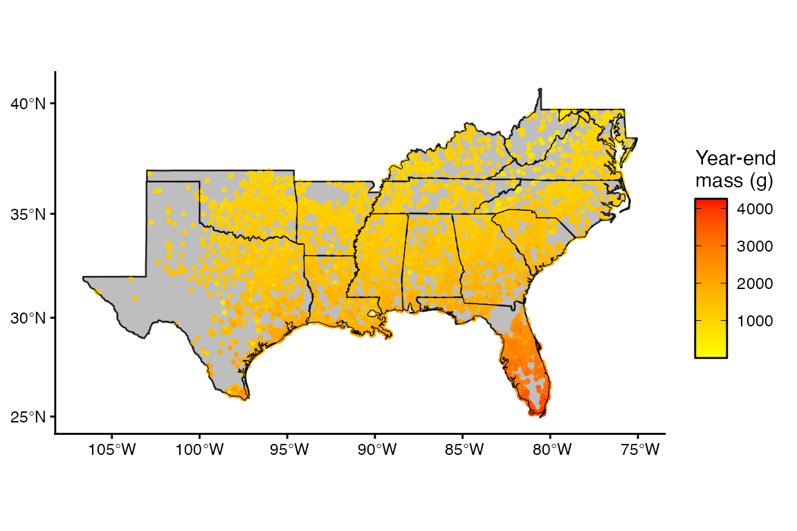
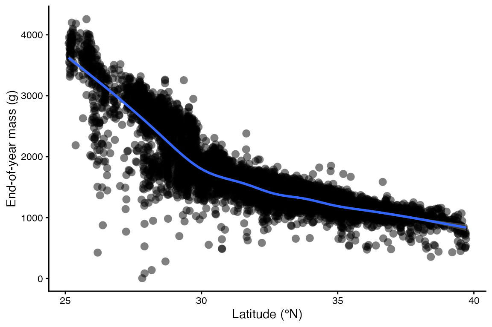
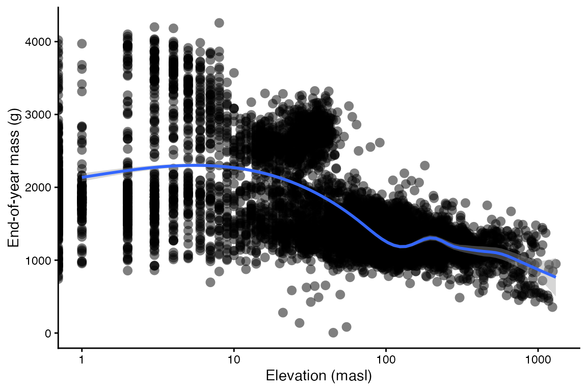
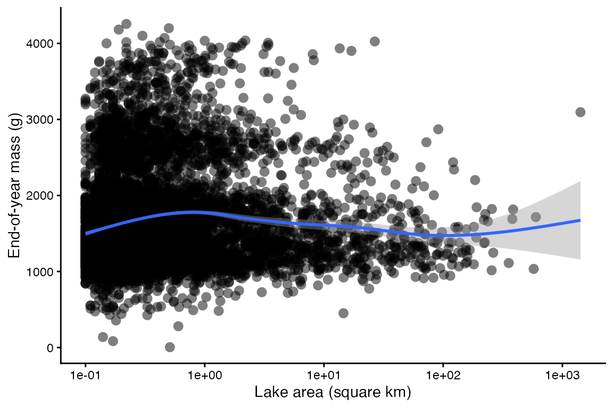
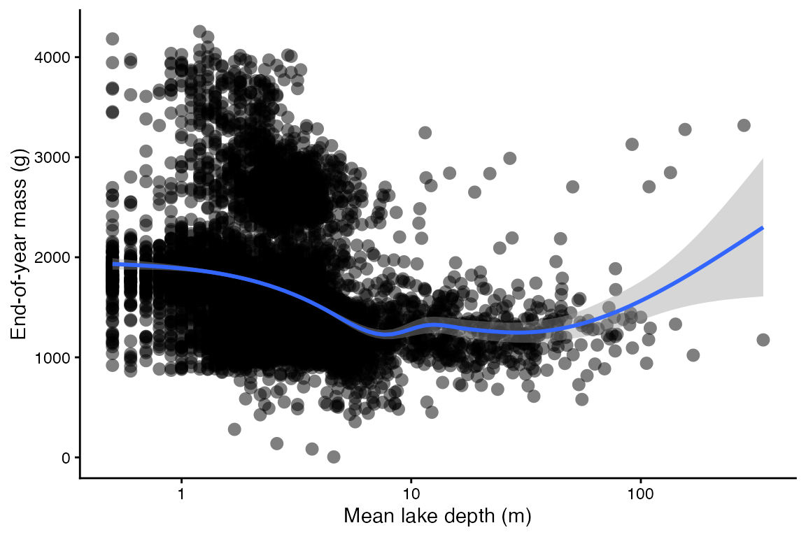

# Mapping Largemouth bass

### In this vignette, you will:

1.  Explore spatial variation in the performance of Largemouth bass
    (Micropterus salmoides) in lakes across the southeastern United
    States.
2.  Use bioenergetics modeling to simulate individual performance
    metrics across 8,001 lakes (lentic habitat patches)
3.  Create maps showing spatially-contiguous variation in these
    performance metrics and drivers of this spatial variation (e.g.,
    temperature).

##### 

First, install the fishyenergy package and load the library.
Dependencies include reshape2, stringr, terra, sf, lubridate, and
ggplot2.

``` r

remotes::install_github("bomeara/fishyenergy")
library(FishyEnergy)
```

##### 

Next, load the intrinsic bioenergetics parameters of five example
species. These parameters have been published by various authors since
the 1980s and are available from Fish Bioenergetics 4.0 (FB4)

``` r

data(parms_fb4)
```

##### 

Let’s retain only one focal species, Largemouth bass, and look at these
data.

``` r

options(width = 500)
parms.micsal <- parms_fb4[parms_fb4$genus_species == "micropterus_salmoides",]
parms.micsal
#>           genus_species LifeStage           Source    lwA   lwB CEQ   CA     CB   CQ  CTO CTM CTL CK1 CK4 REQ       RA     RB     RQ    RTO RTM RTL RK1 RK4     SDA    FA      UA pred_ED
#> 2 micropterus_salmoides     adult Rice et al. 1983 0.0226 2.781   2 0.33 -0.325 2.65 27.5  37  NA  NA  NA   1 0.008352 -0.355 0.0313 0.0196   0   0   1   0 0.15848 0.104 0.08817    4184
```

The first column shows the Latin name in snake case. Other columns like
lwA and lwB are the intercept and slope of the length-weight equation.
Still other columns like CA and CB are the intercept and slope of the
mass dependent consumption equation (a negative power law). There’s also
specific dynamic action (i.e., the proportion of energy consumed
allocated to the cost of digestion), predator energy density, and many
other variables defined by Hanson et al. (1997).

##### 

Next, we need to load some parameters that potentially vary temporally.
The dataframe has 365 rows representing each day of the year. There are
five noteworthy columns (i.e., variables):

CP is the proportion of maximum consumption and decrease as prey
quantity declines or as exploitative competition increases.

ACT is the activity multiplier where a value of zero would indicate no
metabolic costs beyond being at rest. Maintaining position in a flowing
stream, avoiding predators, pursuing prey, and engaging in reproductive
behavior increase ACT.

The next two parameters (gsi_f and gsi_m) allow the user to model
somatic growth of a reproductively mature fish that allocates some
energy to gonadal tissue. Separate parameters are provided for females
and males because the sexes invest different amounts of energy to their
gonads–gsi_f and gsi_m, respectively. The default data assume a
reproductively immature fish (i.e., gsi = 0).

Modifying prey energy density (prey_ED) over the year can simulate
ontogenetic diet shifts or changes in prey quality. There are numerous
published estimates of prey energy density for common prey items like
invertebrates, fish, and so on.

``` r

options(width = 500)
data(parms_temporal_DEFAULT)
dim(parms_temporal_DEFAULT)
#> [1] 365   6
head(parms_temporal_DEFAULT)
#>       date CP ACT gsi_f gsi_m prey_ED
#> 1 1/1/2025  1   1     0     0    3698
#> 2 1/2/2025  1   1     0     0    3698
#> 3 1/3/2025  1   1     0     0    3698
#> 4 1/4/2025  1   1     0     0    3698
#> 5 1/5/2025  1   1     0     0    3698
#> 6 1/6/2025  1   1     0     0    3698
```

##### 

Let’s modify CP and ACT to more realistic values. Specifically, we will
use CP = 0.82 and ACT = 1.69. These parameter values were validated
using age-1 largemouth bass from Watts Bar Lake in East Tennessee, USA.
See the Validation vignette for details.

``` r

options(width = 500)
parms_temporal_DEFAULT$CP = 0.82
parms_temporal_DEFAULT$ACT = 1.69
head(parms_temporal_DEFAULT)
#>       date   CP  ACT gsi_f gsi_m prey_ED
#> 1 1/1/2025 0.82 1.69     0     0    3698
#> 2 1/2/2025 0.82 1.69     0     0    3698
#> 3 1/3/2025 0.82 1.69     0     0    3698
#> 4 1/4/2025 0.82 1.69     0     0    3698
#> 5 1/5/2025 0.82 1.69     0     0    3698
#> 6 1/6/2025 0.82 1.69     0     0    3698
```

##### 

Let’s explore some lake temperature data modified from the open-source
LakeTEMP dataset (Korver et al. 2024). In brief, this dataset provides
monthly lake surface temperatures for 1,427,688 lakes throughout the
world as well as some geographic (e.g., elevation above sea level) and
bathymetric (e.g., lake depth) covariates for these lakes. In
fishyenergy, we have extracted these monthly temperatures and covariates
for 8,001 lakes in 15 southeastern US states plus Puerto Rico. We then
used a generalized additive model fitted to monthly temperatures to
interpolate temperatures to the daily resolution needed for
bioenergetics modeling. Let’s load this dataset called temps_lake in
fishyenergy.

The dataset has 8,001 rows each representing a different lake and 366
columns representing the unique lake ID (Hylak_id) followed by the 365
julian days.

``` r

options(width = 500)
data(temps_lake)
dim(temps_lake)
#> [1] 8001  366
head(temps_lake[,1:91])
#>           Hylak_id julian001 julian002 julian003 julian004 julian005 julian006 julian007 julian008 julian009 julian010 julian011 julian012 julian013 julian014 julian015 julian016 julian017 julian018 julian019 julian020 julian021 julian022 julian023 julian024 julian025 julian026 julian027 julian028 julian029 julian030 julian031 julian032 julian033 julian034 julian035 julian036 julian037 julian038 julian039 julian040 julian041 julian042 julian043 julian044 julian045 julian046 julian047 julian048
#> 1 Hylak_id.0000069       192       191       191       191       190       190       190       190       189       189       189       189       189       188       188       188       188       188       188       188       188       188       188       189       189       189       189       189       190       190       190       191       191       191       192       192       192       193       193       194       194       195       196       196       197       197       198       199
#> 2 Hylak_id.0000800        66        65        65        64        63        63        62        61        61        60        60        59        59        59        58        58        58        57        57        57        57        57        57        57        57        57        57        57        57        57        58        58        58        59        59        60        60        61        61        62        62        63        64        64        65        66        67        68
#> 3 Hylak_id.0000801        56        55        54        53        53        52        51        51        50        50        49        49        48        48        47        47        47        47        46        46        46        46        46        46        46        46        47        47        47        47        48        48        49        49        50        50        51        51        52        53        54        55        55        56        57        58        59        60
#> 4 Hylak_id.0000803        85        84        83        82        81        80        79        78        77        76        76        75        74        73        73        72        71        71        70        70        69        69        69        68        68        68        67        67        67        67        67        67        67        67        67        67        67        67        67        68        68        68        69        69        70        70        71        71
#> 5 Hylak_id.0000805        75        74        73        72        71        70        69        68        67        66        65        64        64        63        62        61        61        60        59        59        58        58        58        57        57        57        56        56        56        56        56        56        56        56        56        56        56        56        56        57        57        57        58        58        59        59        60        61
#> 6 Hylak_id.0000806        45        44        44        43        42        41        40        39        39        38        37        37        36        35        35        35        34        34        34        33        33        33        33        33        33        33        33        33        33        34        34        34        35        35        36        36        37        37        38        39        40        40        41        42        43        44        45        46
#>   julian049 julian050 julian051 julian052 julian053 julian054 julian055 julian056 julian057 julian058 julian059 julian060 julian061 julian062 julian063 julian064 julian065 julian066 julian067 julian068 julian069 julian070 julian071 julian072 julian073 julian074 julian075 julian076 julian077 julian078 julian079 julian080 julian081 julian082 julian083 julian084 julian085 julian086 julian087 julian088 julian089 julian090
#> 1       200       200       201       202       202       203       204       205       206       207       207       208       209       210       211       212       213       214       215       216       217       217       218       219       220       221       222       223       224       225       226       227       228       229       230       231       232       233       234       235       236       237
#> 2        69        70        70        71        72        74        75        76        77        78        79        80        82        83        84        86        87        88        90        91        92        94        95        97        98       100       101       103       104       106       107       109       110       112       114       115       117       118       120       122       123       125
#> 3        62        63        64        65        66        68        69        70        72        73        75        76        78        79        81        82        84        86        87        89        91        92        94        96        98        99       101       103       105       107       109       110       112       114       116       118       120       122       124       126       127       129
#> 4        72        72        73        74        74        75        76        77        78        79        79        80        81        82        84        85        86        87        88        89        91        92        93        94        96        97        99       100       101       103       104       106       107       109       111       112       114       116       117       119       121       122
#> 5        61        62        63        63        64        65        66        67        68        69        70        71        72        73        74        76        77        78        79        81        82        83        85        86        88        89        90        92        94        95        97        98       100       101       103       105       106       108       110       112       113       115
#> 6        47        48        50        51        52        53        55        56        57        59        60        62        63        65        66        68        70        71        73        75        76        78        80        82        83        85        87        89        91        93        94        96        98       100       102       104       106       108       110       112       114       116
```

##### 

Let’s visualize the spatial and temporal variation in these temperature
data. Each line is one of the 8,001 lakes.

``` r

library(reshape2)
temps_lake.long <- melt(temps_lake, id.vars = "Hylak_id", value.name = "WT_mean")
temps_lake.long$date <- as.numeric(gsub("julian","", temps_lake.long$variable))

library(ggplot2)
ggplot(NULL) + theme_classic() + theme(legend.position = "none") +
    labs(x = "Day of year", y = "Water temperature (°C)") +
    scale_x_continuous(expand = c(0,0), limits = c(0,365), breaks = seq(0,360,60)) +
    scale_y_continuous(expand = c(0,0), limits = c(0,40), breaks = seq(0,40,10)) +
    geom_line(aes(x = date, y = WT_mean / 10, group = Hylak_id), temps_lake.long, linewidth = 0.5, alpha = 0.1)
```



##### 

Let’s map the spatial variation in temperature.

``` r

temps_lake.mean <- aggregate(WT_mean ~ Hylak_id, temps_lake.long, FUN = mean)

data(envir_lake)

temps_lake.mean <- merge(x = temps_lake.mean, y = envir_lake, by = "Hylak_id")

library(sf)
vect.temps_lake.mean <- st_as_sf(temps_lake.mean, crs = "+proj=longlat +datum=WGS84", coords = c("center_long", "center_lat"))

library(terra)
#data(geogr_lake)
geogr_lake <- vect(system.file("extdata", "states_sdafs.shp", package="FishyEnergy")) #("K:\\COS\\TroiaFishEcology\\TroiaMatthew\\utsa_b\\UTSA_v01\\UTSA_research_v01\\project_BEM_package_v01\\for__use_data\\states_sdafs\\states_sdafs.shp")
geogr_lake <- st_as_sf(geogr_lake)

ggplot(NULL) + theme_classic() +
  scale_color_gradient(low = "blue", high = "red") +
  geom_sf(aes(), data = geogr_lake, size = 0.5, fill = "gray") +
  geom_sf(aes(color = WT_mean), data = vect.temps_lake.mean, size = 0.5, shape = 16) +
  geom_sf(aes(), data = geogr_lake, fill = NA, color = "black")
```



##### 

Run the bem_project function to grow a fish for n habitat patches. Be
sure to set the is.raster argument to FALSE because the temperature
input is in tabular form and not raster.

``` r


output.lakes <- bem_project(start_M2 = 454, 
                            temperature = temps_lake,
                            parms.intrinsic = parms.micsal,
                            parms.temporal = parms_temporal_DEFAULT,
                            C_eq = 2,
                            R_eq = 1,
                            is.raster = FALSE)
```

##### 

Output from bem_project is a list of length three.

1.  The first list element is the run time. The bem_project function,
    like the bem_validate function, takes some time to run and that time
    increases with the number of habitat patches.

``` r

output.lakes$run.time
#> [1] "Run time is 23.73 minutes for 8001 habitat patches"
```

2.  The last two outputs are tabular. The first, year.end.perform, has a
    number of rows equal to the number of habitat patches. There are two
    columns representing the habitat patch ID and the simulated
    end-of-year mass (M2_cum).

``` r

options(width = 500)
head(output.lakes$year.end.perform)
#>            patchID   M2_end   M2_dif    M1_m01    M1_m02    M1_m03     M1_m04   M1_m05   M1_m06   M1_m07    M1_m08    M1_m09    M1_m10     M1_m11    M1_m12   M1_cold  M1_warm     K_min K_yday def_days
#> 1 Hylak_id.0000069 3095.503 581.8289  187283.3  242804.5  488011.8 742221.085 936440.1 875614.8 870556.4 1107780.0 1456433.3 1723368.4 1406908.48 1014625.1  187283.3 870556.4 0.8925071    365        0
#> 2 Hylak_id.0000800 1015.256 123.6247 -223363.7 -187088.3 -145873.3  -6240.192 258383.5 515587.6 607000.3  750784.2  838907.7  435271.4 -137205.87 -357868.6 -223363.7 607000.3 0.7176806    107      106
#> 3 Hylak_id.0000801 1033.946 127.7414 -230186.7 -191883.7 -143872.9  19662.329 302007.7 536111.6 629523.4  787655.4  847734.6  420784.9 -167279.81 -383764.6 -230186.7 629523.4 0.7174782    103      102
#> 4 Hylak_id.0000803 1199.465 164.1993 -210330.2 -184621.9 -150829.1  -6406.875 284787.1 530938.1 667133.9  811881.1  915614.0  704497.8   61462.05 -305101.9 -184621.9 667133.9 0.7221178    107      106
#> 5 Hylak_id.0000805 1094.130 140.9978 -220449.8 -192132.4 -162214.3 -31802.127 229435.6 490861.2 636609.7  776988.1  854784.7  605711.1   10346.67 -319836.4 -192132.4 636609.7 0.6992432    111      110
#> 6 Hylak_id.0000806  956.918 110.7749 -235380.7 -198924.8 -164688.6 -21413.710 256789.0 505718.2 564379.1  711167.0  823361.7  418151.5 -174735.41 -380215.3 -235380.7 564379.1 0.6888623    109      108
```

3.  The other tabular output, daily.output, is a list with a number of
    elements equal to the number of habitat patches. Each element is
    dataframe with the same 365 rows and 43 columns produced by the
    bem_grow function.

``` r

options(width = 500)
head(output.lakes$daily.output[[1]])
#>        date WT_mean pred_ED gsi_m gsi_f  CP ACT prey_ED C1_ins   C2_ins R1_ins   R2_ins F1_ins   F2_ins U1_ins   U2_ins SDA1_ins SDA2_ins  MS1_ins MS2_ins MG1_ins MG2_ins   M1_ins M2_ins C1_cum    C2_cum R1_cum   R2_cum F1_cum    F2_cum U1_cum    U2_cum SDA1_cum  SDA2_cum  MS1_cum MS2_cum MG1_cum MG2_cum   M1_cum  M2_cum    L_cum        K
#> 1 julian001    19.2    4184     0     0 0.8 1.7    3698  0.000     0.00  0.000     0.00  0.000    0.000  0.000    0.000    0.000    0.000    0.000   0.000       0       0    0.000  0.000  0.000      0.00  0.000     0.00  0.000     0.000  0.000     0.000    0.000     0.000     0.00 454.000       0       0     0.00 454.000 35.25870 1.000000
#> 2 julian002    19.1    4184     0     0 0.8 1.7    3698  9.912 36654.52  1.328 18004.13  1.031 3812.070  0.874 3231.829    1.407 5204.872 6401.620   1.530       0       0 6401.620  1.530  9.912  36654.52  1.328 18004.13  1.031  3812.070  0.874  3231.829    1.407  5204.872  6401.62 455.530       0       0  6401.62 455.530 35.25870 1.039246
#> 3 julian003    19.1    4184     0     0 0.8 1.7    3698  9.935 36737.86  1.331 18043.24  1.033 3820.737  0.876 3239.177    1.411 5216.705 6417.996   1.534       0       0 6417.996  1.534 19.847  73392.38  2.658 36047.38  2.064  7632.808  1.750  6471.006    2.818 10421.577 12819.61 457.064       0       0 12819.61 457.064 35.30138 1.038968
#> 4 julian004    19.1    4184     0     0 0.8 1.7    3698  9.957 36821.32  1.334 18082.41  1.036 3829.417  0.878 3246.536    1.414 5228.556 6434.399   1.538       0       0 6434.399  1.538 29.804 110213.70  3.992 54129.79  3.100 11462.225  2.628  9717.542    4.232 15650.134 19254.01 458.602       0       0 19254.01 458.602 35.34408 1.038690
#> 5 julian005    19.0    4184     0     0 0.8 1.7    3698  9.876 36521.13  1.332 18065.00  1.027 3798.198  0.871 3220.068    1.402 5185.931 6251.940   1.494       0       0 6251.940  1.494 39.680 146734.83  5.324 72194.78  4.127 15260.423  3.499 12937.610    5.634 20836.065 25505.96 460.096       0       0 25505.96 460.096 35.38679 1.038305
#> 6 julian006    19.0    4184     0     0 0.8 1.7    3698  9.898 36601.41  1.335 18102.94  1.029 3806.547  0.873 3227.147    1.405 5197.330 6267.450   1.498       0       0 6267.450  1.498 49.577 183336.25  6.659 90297.72  5.156 19066.970  4.371 16164.757    7.040 26033.395 31773.40 461.594       0       0 31773.40 461.594 35.42821 1.038036
```

##### 

Mapping simulated performance across habitat patches.

``` r

perf.lakes <- output.lakes$year.end.perform
colnames(perf.lakes) <- c("Hylak_id", "M2_cum")

perf.lakes <- merge(x = perf.lakes, y = envir_lake, by = "Hylak_id")

vect.perf.lakes <- st_as_sf(perf.lakes, crs = "+proj=longlat +datum=WGS84", coords = c("center_long", "center_lat"))

ggplot(NULL) + theme_classic() +
  scale_colour_gradient("Year-end\nmass (g)",
                        low = "yellow", high = "red",
                        guide = guide_colorbar(frame.colour = "black", ticks.colour = "black")) +
  geom_sf(aes(), data = geogr_lake, size = 0.5, fill = "gray") +
  geom_sf(aes(color = M2_cum), data = vect.perf.lakes, size = 1, shape = 16) +
  geom_sf(aes(), data = geogr_lake, fill = NA, color = "black")
```



##### 

What is the relationship between environmental variables and largemouth
bass performance? Let’s plot and see. Each point represents a different
lake in the southeastern US.

``` r

ggplot(NULL) + theme_classic() + theme(legend.position = "none") +
    labs(x = "Latitude (°N)", y = "End-of-year mass (g)") +
    geom_point(aes(x = center_lat, y = M2_cum), perf.lakes, shape = 16, size = 3, alpha = 0.5) +
    geom_smooth(aes(x = center_lat, y = M2_cum), perf.lakes, method = "gam")
```



``` r


ggplot(NULL) + theme_classic() + theme(legend.position = "none") +
    labs(x = "Elevation (masl)", y = "End-of-year mass (g)") +
    scale_x_log10() +
    geom_point(aes(x = Elevation, y = M2_cum), perf.lakes, shape = 16, size = 3, alpha = 0.5) +
    geom_smooth(aes(x = Elevation, y = M2_cum), perf.lakes, method = "gam")
```



``` r


ggplot(NULL) + theme_classic() + theme(legend.position = "none") +
    labs(x = "Lake area (square km)", y = "End-of-year mass (g)") +
    scale_x_log10() +
    geom_point(aes(x = Lake_area, y = M2_cum), perf.lakes, shape = 16, size = 3, alpha = 0.5) +
    geom_smooth(aes(x = Lake_area, y = M2_cum), perf.lakes, method = "gam")
```



``` r


ggplot(NULL) + theme_classic() + theme(legend.position = "none") +
    labs(x = "Mean lake depth (m)", y = "End-of-year mass (g)") +
    scale_x_log10() +
    geom_point(aes(x = Depth_avg, y = M2_cum), perf.lakes, shape = 16, size = 3, alpha = 0.5) +
    geom_smooth(aes(x = Depth_avg, y = M2_cum), perf.lakes, method = "gam")
```


