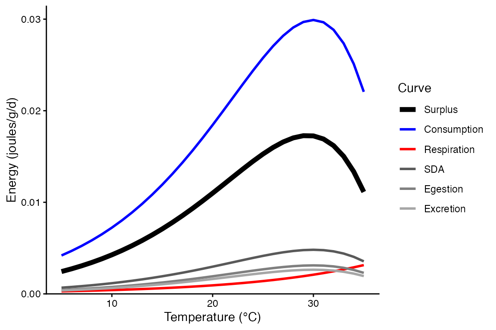
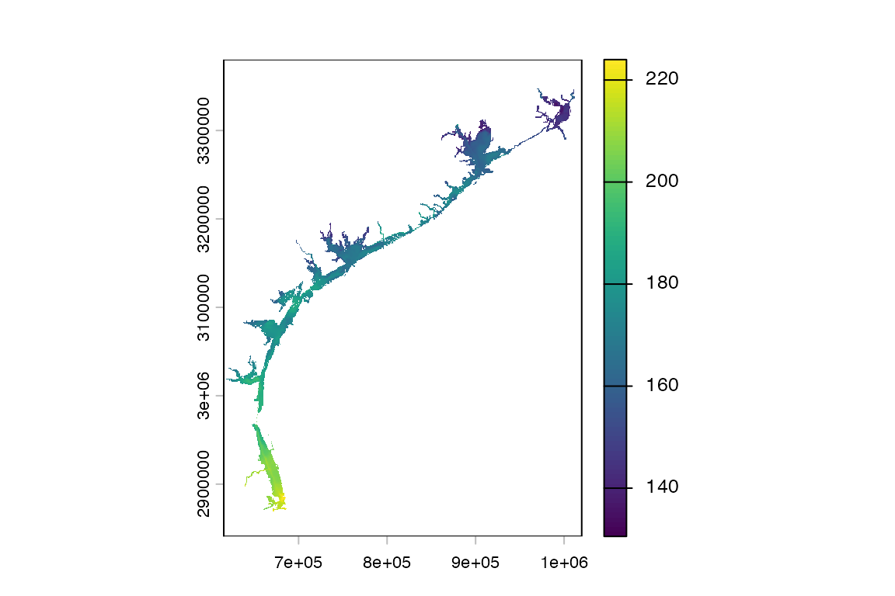
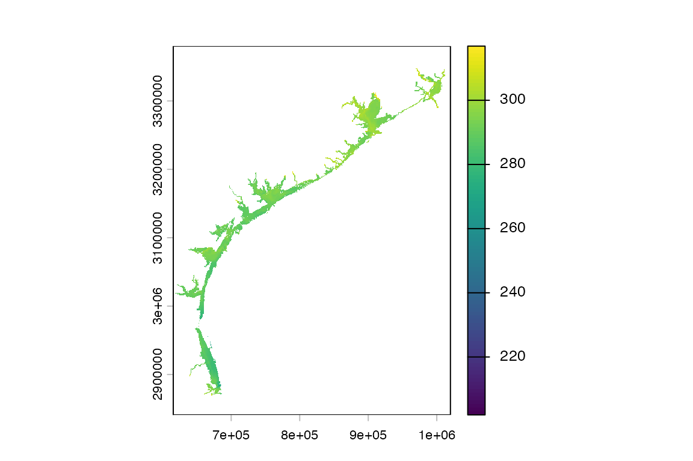
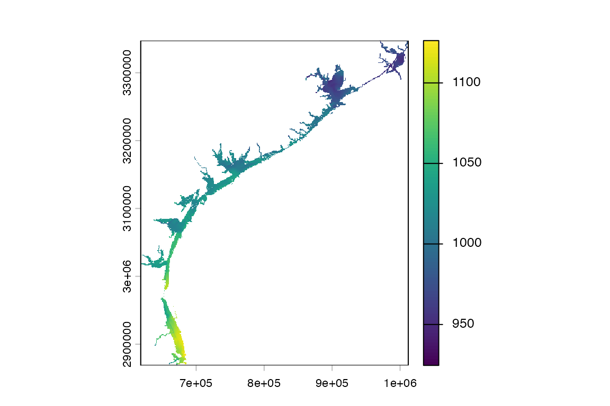

# Mapping Southern flounder

### In this vignette, you will:

1.  Explore spatial variation in the performance of southern flounder
    (Paralichthys lethostigma) in coastal bays and estuaries of the
    western Gulf of Mexico, Texas, USA.
2.  Use bioenergetics modeling to simulate individual performance
    metrics across 8,862 1-square-km grid cells.
3.  Create maps showing spatially-contiguous variation in these
    performance metrics and drivers of this spatial variation (e.g.,
    temperature).

##### 

First, install the fishyenergy package and load the library.
Dependencies include reshape2, stringr, terra, sf, lubridate, and
ggplot2.

``` r

remotes::install_github("bomeara/fishyenergy")
library(FishyEnergy)
```

##### 

Next, load the intrinsic bioenergetics parameters of five example
species. These parameters have been published by various authors since
the 1980s and are available from Fish Bioenergetics 4.0 (FB4)

``` r

data(parms_fb4)
```

##### 

Let’s retain only one focal species, the southern flounder, and look at
these data.

``` r

options(width = 500)
parms.parlet <- parms_fb4[parms_fb4$genus_species == "paralichthys_lethostigma",]
parms.parlet
#>              genus_species   LifeStage            Source     lwA  lwB CEQ     CA    CB    CQ CTO CTM CTL CK1 CK4 REQ       RA      RB     RQ    RTO RTM RTL RK1 RK4    SDA    FA     UA pred_ED
#> 4 paralichthys_lethostigma unspecified Burke & Rice 2002 0.00562 3.21   2 0.1993 -0.31 2.126  30  40  NA  NA  NA   1 0.000432 -0.1397 0.0811 0.7419   0   0   0   0 0.1797 0.104 0.0882    4289
```

The first column shows the Latin name in snake case. Other columns like
lwA and lwB are the intercept and slope of the length-weight equation.
Still other columns like CA and CB are the intercept and slope of the
mass dependent consumption equation (a negative power law). There’s also
specific dynamic action (i.e., the proportion of energy consumed
allocated to the cost of digestion), predator energy density, and many
other variables defined by Hanson et al. (1997).

Let’s plot the temperature dependent parameters for southern flounder.

``` r

bem_curve(M = 454,
          T = 5:35,
          CP = 1.0,
          ACT = 1.0,
          prey_ED = 4000,
          parms.intrinsic = parms.parlet,
          C_eq = 2,
          R_eq = 1)
```



##### 

Next, we need to load some parameters that potentially vary temporally.
The dataframe has 365 rows representing each day of the year. There are
five noteworthy columns (i.e., variables):

CP is the proportion of maximum consumption and decrease as prey
quantity declines or as exploitative competition increases.

ACT is the activity multiplier where a value of zero would indicate no
metabolic costs beyond being at rest. Maintaining position in a flowing
stream, avoiding predators, pursuing prey, and engaging in reproductive
behavior increase ACT.

The next two parameters (gsi_f and gsi_m) allow the user to model
somatic growth of a reproductively mature fish that allocates some
energy to gonadal tissue. Separate parameters are provided for females
and males because the sexes invest different amounts of energy to their
gonads–gsi_f and gsi_m, respectively. The default data assume a
reproductively immature fish (i.e., gsi = 0).

Modifying prey energy density (prey_ED) over the year can simulate
ontogenetic diet shifts or changes in prey quality. There are numerous
published estimates of prey energy density for common prey items like
invertebrates, fish, and so on.

``` r

options(width = 500)
data(parms_temporal_DEFAULT)
dim(parms_temporal_DEFAULT)
#> [1] 365   6
head(parms_temporal_DEFAULT)
#>       date CP ACT gsi_f gsi_m prey_ED
#> 1 1/1/2025  1   1     0     0    3698
#> 2 1/2/2025  1   1     0     0    3698
#> 3 1/3/2025  1   1     0     0    3698
#> 4 1/4/2025  1   1     0     0    3698
#> 5 1/5/2025  1   1     0     0    3698
#> 6 1/6/2025  1   1     0     0    3698
```

##### 

Let’s modify CP and ACT to more realistic values. Specifically, we will
use CP = 0.75 and ACT = 1.50 These parameter values were validated
behind the scenes using the bem_validate function. See the Validation
vignette for details.

``` r

options(width = 500)
parms_temporal_DEFAULT$CP = 0.75
parms_temporal_DEFAULT$ACT = 1.50
head(parms_temporal_DEFAULT)
#>       date   CP ACT gsi_f gsi_m prey_ED
#> 1 1/1/2025 0.75 1.5     0     0    3698
#> 2 1/2/2025 0.75 1.5     0     0    3698
#> 3 1/3/2025 0.75 1.5     0     0    3698
#> 4 1/4/2025 0.75 1.5     0     0    3698
#> 5 1/5/2025 0.75 1.5     0     0    3698
#> 6 1/6/2025 0.75 1.5     0     0    3698
```

##### 

Let’s explore some coastal temperature data modified from the
open-source [Texas BAYCAST
dataset](https://www.twdb.texas.gov/surfacewater/bays/models/index.asp)
. In brief, this dataset provides daily ocean/estuary surface
temperatures along the western coast of the Gulf of Mexico. In
fishyenergy, we provide a 1-square-km resolution raster layer of these
temperatures.

##### 

Let’s load this dataset called temps_bayc in fishyenergy and map the
spatial variation in temperature. These data are formatted as a
3-dimensional array with spatial dimensions of 542 vertical pixels by
410 horizontal pixels and 365 days in the temporal dimension. Note that
only 8,862 of the 222,220 spatial pixels represent a bay/estuary and
have a temperature value.

``` r

library(terra)
temps_bayc <- rast(system.file("extdata", "temps_bayc.tif", package="FishyEnergy"))
```

##### 

Let’s visualize the spatial variation in these temperature data. Surface
water temperatures on January 1st range from approximately 13 to 22°C
along the Texas Gulf Coast. On August 1st, temperatures range from 27 to
32°C.

``` r

plot(temps_bayc[[001]])
```



``` r

plot(temps_bayc[[213]])
```



##### 

Run the bem_project function to grow a fish for n habitat patches. Be
sure to set the is.raster argument to TRUE because the temperature input
is a raster and not in tabular form.

``` r

output.bayc <- bem_project(start_M2 = 454, 
                           temperature = temps_bayc,
                           parms.intrinsic = parms.parlet,
                           parms.temporal = parms_temporal_DEFAULT,
                           C_eq = 2,
                           R_eq = 1,
                           is.raster = TRUE)
```

##### 

Output from bem_project is a list of length three.

1.  The first list element is the run time. The bem_project function,
    like the bem_validate function, takes some time to run and that time
    increases with the number of habitat patches.

``` r

output.bayc$run.time
#> [1] "Run time is 26.33 minutes for 8862 habitat patches"
```

2.  The last two outputs are tabular. The first, year.end.perform, has a
    number of rows equal to the number of habitat patches. There are two
    columns representing the habitat patch ID and the simulated
    end-of-year mass (M2_cum).

``` r

options(width = 500)
head(output.bayc$year.end.perform)
#>   M2_end M2_dif M1_m01 M1_m02 M1_m03 M1_m04 M1_m05 M1_m06 M1_m07 M1_m08 M1_m09 M1_m10 M1_m11 M1_m12 M1_cold M1_warm K_min K_yday def_days
#> 1     NA     NA     NA     NA     NA     NA     NA     NA     NA     NA     NA     NA     NA     NA      NA      NA    NA     NA       NA
#> 2     NA     NA     NA     NA     NA     NA     NA     NA     NA     NA     NA     NA     NA     NA      NA      NA    NA     NA       NA
#> 3     NA     NA     NA     NA     NA     NA     NA     NA     NA     NA     NA     NA     NA     NA      NA      NA    NA     NA       NA
#> 4     NA     NA     NA     NA     NA     NA     NA     NA     NA     NA     NA     NA     NA     NA      NA      NA    NA     NA       NA
#> 5     NA     NA     NA     NA     NA     NA     NA     NA     NA     NA     NA     NA     NA     NA      NA      NA    NA     NA       NA
#> 6     NA     NA     NA     NA     NA     NA     NA     NA     NA     NA     NA     NA     NA     NA      NA      NA    NA     NA       NA
```

3.  The other tabular output, daily.output, is a list with a number of
    elements equal to the number of habitat patches. Each element is
    dataframe with the same 365 rows and 43 columns produced by the
    bem_grow function.

``` r

options(width = 500)
head(output.bayc$daily.output[[1]])
#>        date WT_mean pred_ED gsi_m gsi_f  CP ACT prey_ED C1_ins   C2_ins R1_ins   R2_ins F1_ins   F2_ins U1_ins   U2_ins SDA1_ins SDA2_ins  MS1_ins MS2_ins MG1_ins MG2_ins   M1_ins M2_ins C1_cum   C2_cum R1_cum    R2_cum F1_cum   F2_cum U1_cum   U2_cum SDA1_cum  SDA2_cum   MS1_cum MS2_cum MG1_cum MG2_cum    M1_cum  M2_cum    L_cum        K
#> 1 julian001    16.0    4289     0     0 0.8 1.5    3698  0.000     0.00  0.000    0.000  0.000    0.000  0.000    0.000    0.000    0.000    0.000   0.000       0       0    0.000  0.000  0.000     0.00  0.000     0.000  0.000    0.000  0.000    0.000    0.000     0.000     0.000 454.000       0       0     0.000 454.000 33.78781 1.000000
#> 2 julian002    15.4    4289     0     0 0.8 1.5    3698  4.217 15593.06  0.436 5917.082  0.439 1621.678  0.372 1375.308    0.679 2510.657 4168.332   0.972       0       0 4168.332  0.972  4.217 15593.06  0.436  5917.082  0.439 1621.678  0.372 1375.308    0.679  2510.657  4168.332 454.972       0       0  4168.332 454.972 33.78781 1.179518
#> 3 julian003    15.9    4289     0     0 0.8 1.5    3698  4.423 16357.94  0.455 6173.297  0.460 1701.226  0.390 1442.770    0.712 2633.812 4406.836   1.027       0       0 4406.836  1.027  8.640 31951.00  0.892 12090.379  0.899 3322.904  0.762 2818.078    1.391  5144.469  8575.169 455.999       0       0  8575.169 455.999 33.81032 1.179822
#> 4 julian004    16.2    4289     0     0 0.8 1.5    3698  4.554 16840.62  0.467 6337.623  0.474 1751.424  0.402 1485.342    0.733 2711.528 4554.700   1.062       0       0 4554.700  1.062 13.194 48791.62  1.359 18428.002  1.372 5074.328  1.164 4303.421    2.124  7855.997 13129.869 457.061       0       0 13129.869 457.061 33.83409 1.180079
#> 5 julian005    16.7    4289     0     0 0.8 1.5    3698  4.773 17649.58  0.488 6613.116  0.496 1835.557  0.421 1556.693    0.768 2841.781 4802.437   1.120       0       0 4802.437  1.120 17.967 66441.20  1.847 25041.118  1.869 6909.885  1.585 5860.114    2.893 10697.777 17932.306 458.181       0       0 17932.306 458.181 33.85862 1.180401
#> 6 julian006    14.4    4289     0     0 0.8 1.5    3698  3.860 14273.43  0.406 5499.350  0.401 1484.436  0.340 1258.916    0.621 2298.182 3732.543   0.870       0       0 3732.543  0.870 21.827 80714.63  2.252 30540.468  2.270 8394.321  1.925 7119.030    3.514 12995.959 21664.849 459.051       0       0 21664.849 459.051 33.88443 1.179941
```

##### 

Mapping simulated performance across habitat patches.

``` r

plot(output.bayc$year.end.perform$M2_end)
```


