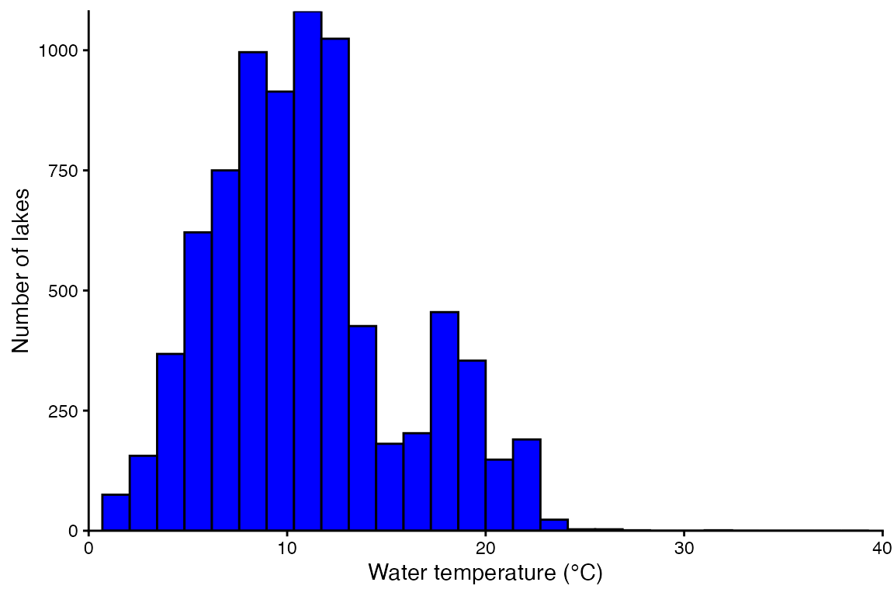
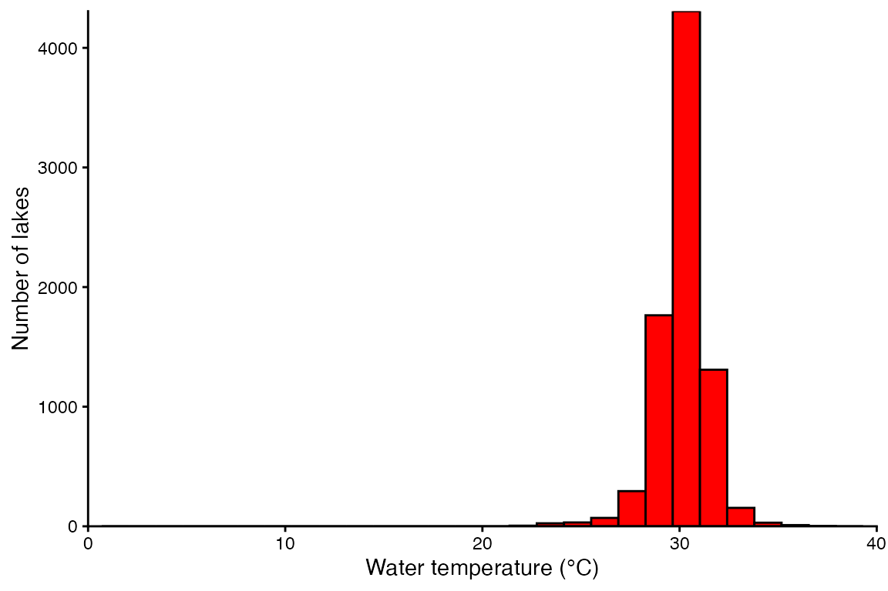
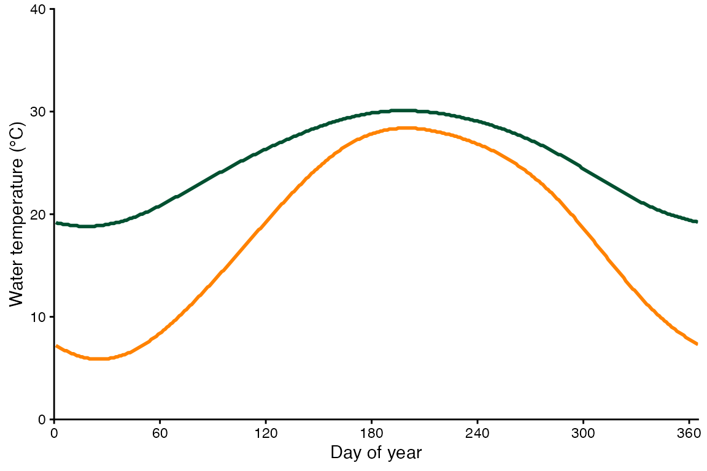
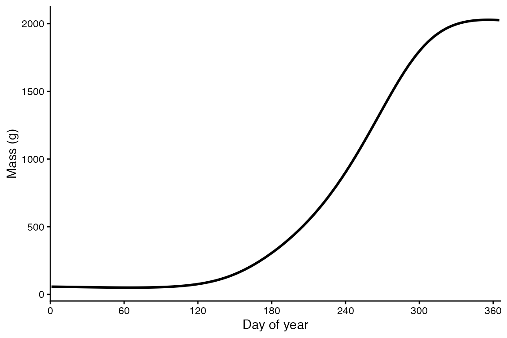
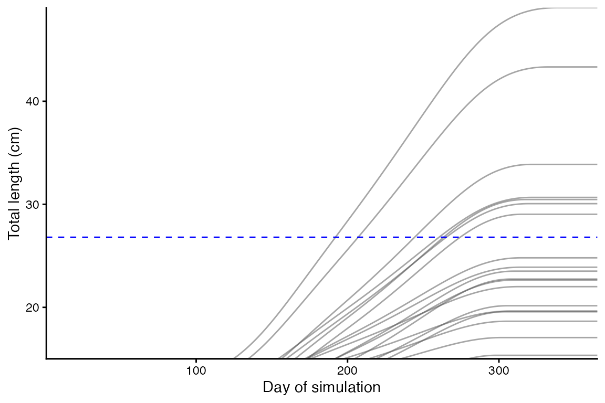
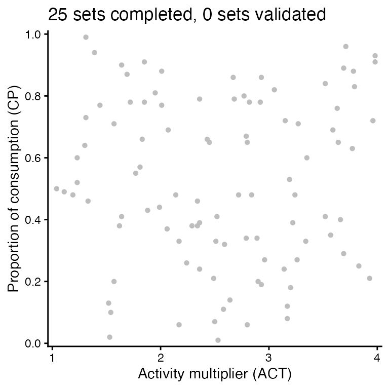

# Validation

### In this vignette, you will:

1.  Learn how to validate a bionenergetics model. That is, you will
    simulate 365 days of growth and then use empirical length-at-age
    estimates from a field study or lab growth experiment to identify
    consumption (CP) and activity (ACT) values that produce realistic
    growth.
2.  Visualize growth trajectories.
3.  Visualize validated combinations of CP and ACT.

##### 

First, install the fishyenergy package and load the library.
Dependencies include reshape2, stringr, terra, sf, lubridate, and
ggplot2.

``` r

remotes::install_github("bomeara/fishyenergy")
library(FishyEnergy)
```

##### 

#### Temperature-dependent physiological rates

Next, let’s look at temperature-dependent physiological rates of a few
species. Start by loading the intrinsic bioenergetics parameters of five
example species. These parameters have been published by various authors
since the 1980s and are available from Fish Bioenergetics 4.0 (FB4)

``` r

options(width = 500)
data(parms_fb4)
```

##### 

Let’s retain only one focal species, largemouth bass, and look at these
data. The first column shows the Latin name in snake case. Other columns
like lwA and lwB are the intercept and slope of the length-weight
equation. Still other columns like CA and CB are the intercept and slope
of the mass dependent consumption equation (a negative power law).
There’s also specific dynamic action (i.e., the proportion of energy
consumed allocated to the cost of digestion), predator energy density,
and many other variables defined by Hanson et al. (1997).

``` r

options(width = 500)
parms.micsal <- parms_fb4[parms_fb4$genus_species == "micropterus_salmoides",]
parms.micsal
#>           genus_species LifeStage           Source    lwA   lwB CEQ   CA     CB   CQ  CTO CTM CTL CK1 CK4 REQ       RA     RB     RQ    RTO RTM RTL RK1 RK4     SDA    FA      UA pred_ED
#> 2 micropterus_salmoides     adult Rice et al. 1983 0.0226 2.781   2 0.33 -0.325 2.65 27.5  37  NA  NA  NA   1 0.008352 -0.355 0.0313 0.0196   0   0   1   0 0.15848 0.104 0.08817    4184
```

##### 

Next, we need to load some parameters that potentially vary temporally.
The dataframe has 365 rows representing each day of the year. There are
five noteworthy columns (i.e., variables):

CP is the proportion of maximum consumption and decrease as prey
quantity declines or as exploitative competition increases.

ACT is the activity multiplier where a value of zero would indicate no
metabolic costs beyond being at rest. Maintaining position in a flowing
stream, avoiding predators, pursuing prey, and engaging in reproductive
behavior increase ACT.

The next two parameters (gsi_f and gsi_m) allow the user to model
somatic growth of a reproductively mature fish that allocates some
energy to gonadal tissue. Separate parameters are provided for females
and males because the sexes invest different amounts of energy to their
gonads–gsi_f and gsi_m, respectively. The default data assume a
reproductively immature fish (i.e., gsi = 0).

Modifying prey energy density (prey_ED) over the year can simulate
ontogenetic diet shifts or changes in prey quality. There are numerous
published estimates of prey energy density for common prey items like
invertebrates, fish, and so on.

``` r

options(width = 500)
data(parms_temporal_DEFAULT)
dim(parms_temporal_DEFAULT)
#> [1] 365   6
head(parms_temporal_DEFAULT)
#>       date CP ACT gsi_f gsi_m prey_ED
#> 1 1/1/2025  1   1     0     0    3698
#> 2 1/2/2025  1   1     0     0    3698
#> 3 1/3/2025  1   1     0     0    3698
#> 4 1/4/2025  1   1     0     0    3698
#> 5 1/5/2025  1   1     0     0    3698
#> 6 1/6/2025  1   1     0     0    3698
```

##### 

Let’s explore some lake temperature data modified from the open-source
LakeTEMP dataset (Korver et al. 2024). In brief, this dataset provides
monthly lake surface temperatures for 1,427,688 lakes throughout the
world as well as some geographic (e.g., elevation above sea level) and
bathymetric (e.g., lake depth) covariates for these lakes. In
fishyenergy, we have extracted these monthly temperatures for 8,001
lakes in 15 southeastern US states plus Puerto Rico. We then used a
generalized additive model fitted to monthly temperatures to interpolate
temperatures to the daily resolution needed for bioenergetics modeling.
Let’s load this dataset called temps_lake in fishyenergy.

The dataset has 8,001 rows each representing a different lake and 366
columns representing the unique lake ID (Hylak_id) followed by the 365
julian days. We print only the first 90 days or three months of the
year.

``` r

options(width = 2000)
data(temps_lake)
dim(temps_lake)
#> [1] 8001  366
head(temps_lake[,1:91])
#>           Hylak_id julian001 julian002 julian003 julian004 julian005 julian006 julian007 julian008 julian009 julian010 julian011 julian012 julian013 julian014 julian015 julian016 julian017 julian018 julian019 julian020 julian021 julian022 julian023 julian024 julian025 julian026 julian027 julian028 julian029 julian030 julian031 julian032 julian033 julian034 julian035 julian036 julian037 julian038 julian039 julian040 julian041 julian042 julian043 julian044 julian045 julian046 julian047 julian048 julian049 julian050 julian051 julian052 julian053 julian054 julian055 julian056 julian057 julian058 julian059 julian060 julian061 julian062 julian063 julian064 julian065 julian066 julian067 julian068 julian069 julian070 julian071 julian072 julian073 julian074 julian075 julian076 julian077 julian078 julian079 julian080 julian081 julian082 julian083 julian084 julian085 julian086 julian087 julian088 julian089 julian090
#> 1 Hylak_id.0000069       192       191       191       191       190       190       190       190       189       189       189       189       189       188       188       188       188       188       188       188       188       188       188       189       189       189       189       189       190       190       190       191       191       191       192       192       192       193       193       194       194       195       196       196       197       197       198       199       200       200       201       202       202       203       204       205       206       207       207       208       209       210       211       212       213       214       215       216       217       217       218       219       220       221       222       223       224       225       226       227       228       229       230       231       232       233       234       235       236       237
#> 2 Hylak_id.0000800        66        65        65        64        63        63        62        61        61        60        60        59        59        59        58        58        58        57        57        57        57        57        57        57        57        57        57        57        57        57        58        58        58        59        59        60        60        61        61        62        62        63        64        64        65        66        67        68        69        70        70        71        72        74        75        76        77        78        79        80        82        83        84        86        87        88        90        91        92        94        95        97        98       100       101       103       104       106       107       109       110       112       114       115       117       118       120       122       123       125
#> 3 Hylak_id.0000801        56        55        54        53        53        52        51        51        50        50        49        49        48        48        47        47        47        47        46        46        46        46        46        46        46        46        47        47        47        47        48        48        49        49        50        50        51        51        52        53        54        55        55        56        57        58        59        60        62        63        64        65        66        68        69        70        72        73        75        76        78        79        81        82        84        86        87        89        91        92        94        96        98        99       101       103       105       107       109       110       112       114       116       118       120       122       124       126       127       129
#> 4 Hylak_id.0000803        85        84        83        82        81        80        79        78        77        76        76        75        74        73        73        72        71        71        70        70        69        69        69        68        68        68        67        67        67        67        67        67        67        67        67        67        67        67        67        68        68        68        69        69        70        70        71        71        72        72        73        74        74        75        76        77        78        79        79        80        81        82        84        85        86        87        88        89        91        92        93        94        96        97        99       100       101       103       104       106       107       109       111       112       114       116       117       119       121       122
#> 5 Hylak_id.0000805        75        74        73        72        71        70        69        68        67        66        65        64        64        63        62        61        61        60        59        59        58        58        58        57        57        57        56        56        56        56        56        56        56        56        56        56        56        56        56        57        57        57        58        58        59        59        60        61        61        62        63        63        64        65        66        67        68        69        70        71        72        73        74        76        77        78        79        81        82        83        85        86        88        89        90        92        94        95        97        98       100       101       103       105       106       108       110       112       113       115
#> 6 Hylak_id.0000806        45        44        44        43        42        41        40        39        39        38        37        37        36        35        35        35        34        34        34        33        33        33        33        33        33        33        33        33        33        34        34        34        35        35        36        36        37        37        38        39        40        40        41        42        43        44        45        46        47        48        50        51        52        53        55        56        57        59        60        62        63        65        66        68        70        71        73        75        76        78        80        82        83        85        87        89        91        93        94        96        98       100       102       104       106       108       110       112       114       116
```

##### 

Let’s visualize the spatial variation in these temperature data. Surface
water temperatures on January 1st range from approximately 0 to 25°C
across these 8,043 lakes. On August 1st, temperatures range from 25 to
35°C.

``` r

library(ggplot2)
ggplot(NULL) + theme_classic() +
    labs(x = "Water temperature (°C)", y = "Number of lakes") +
    scale_x_continuous(expand = c(0,0), limits = c(0,40), breaks = seq(0,40,10)) +
    scale_y_continuous(expand = c(0,0)) +
    geom_histogram(aes(x = julian001 / 10), temps_lake, fill = "blue", color = "black")
```



``` r


ggplot(NULL) + theme_classic() +
    labs(x = "Water temperature (°C)", y = "Number of lakes") +
    scale_x_continuous(expand = c(0,0), limits = c(0,40), breaks = seq(0,40,10)) +
    scale_y_continuous(expand = c(0,0)) +
    geom_histogram(aes(x = julian213 / 10), temps_lake, fill = "red", color = "black")
```



##### 

Let’s visualize the temporal variation in these temperature data for
Watts Bar lake in East Tennessee and for Lake Okeechobee in South
Florida.

``` r


date <- 1:365
WT.FL <- as.numeric(temps_lake[temps_lake$Hylak_id == "Hylak_id.0000069",2:366])
WT.TN <- as.numeric(temps_lake[temps_lake$Hylak_id == "Hylak_id.0000810",2:366])
temps_lake.subset <- data.frame(date,
                                WT.FL,
                                WT.TN)

ggplot(NULL) + theme_classic() +
    labs(x = "Day of year", y = "Water temperature (°C)") +
    scale_x_continuous(expand = c(0,0), limits = c(0,365), breaks = seq(0,360,60)) +
    scale_y_continuous(expand = c(0,0), limits = c(0,40), breaks = seq(0,40,10)) +
    geom_line(aes(x = date, y = WT.FL / 10), temps_lake.subset, color = "#005030", linewidth = 1) +
    geom_line(aes(x = date, y = WT.TN / 10), temps_lake.subset, color = "#FF8200", linewidth = 1)
```



##### 

Do some data wrangling to get the Watts Bar temperature into the format
needed to simulate fish growth. That is, a dataframe with 365 rows
representing each day of a calendar year and two columns representing
the date and the daily mean water temperature.

``` r

options(width = 500)
temps_WattsBar <- temps_lake[temps_lake$Hylak_id == "Hylak_id.0000810",2:366]
temps_WattsBar <- data.frame(t(temps_WattsBar))
colnames(temps_WattsBar) <- c("WT_mean")
rownames(temps_WattsBar) <- NULL
temps_WattsBar$date <- 1:365
temps_WattsBar <- temps_WattsBar[,c("date","WT_mean")]
```

##### 

Next, use the bem_grow function to simulate the daily bioenergetic
budget of an age-1 largemouth bass in Watts Bar. A realistic largemouth
bass living in an East Tennessee reservoir reaches 15 cm total length
and has a mass of 42 grams at the end of its first year, so let’s
simulate growth for that fish.

``` r

grow.micsal_WattsBar <- bem_grow(start_M2 = 57,
                                 temperature = temps_WattsBar,
                                 parms.intrinsic = parms.micsal,
                                 parms.temporal = parms_temporal_DEFAULT,
                                 C_eq = 2,
                                 R_eq = 1)
```

##### 

Plot the time series of m2_cum. This predator fish starts the year at 57
grams (2 ounces) and ends the year at a whopping 1831 grams (~4 pounds),
which is totally unrealistic. This is because we have assumed the
predator fish has limitless food (CP = 1), sets up shop in one place and
never moves (ACT = 1), and allocates no energy to reproduction (gsi\_ =
0).

``` r

ggplot(NULL) + theme_classic() +
  labs(x = "Day of year", y = "Mass (g)") +
  scale_x_continuous(expand = c(0,0), limits = c(0,366), breaks = seq(0, 360, 60)) +
  geom_line(aes(x = date, y = M2_cum), grow.micsal_WattsBar, linewidth = 1)
```



##### 

Obviously CP=1 and ACT=1 are unrealistic, but what are realistic values?
Unclear! These parameters are difficult to estimate for wild fish, but
there is some literature describing ways some approaches to do so

We developed the bem_validate function to address this challenge using
an alterantive approach. What the function does is identify pairs of CP
and ACT values that produce realistic growth. Inputs of bem_validate
include a subset of those you’re familiar with from bem_grow including
temperature, parms.intrinsic, parms.temporal, C_eq, and R_eq.

Three new inputs include:

1.  Total length in cm at the start of the year (start_L). We use total
    length as the input instead of mass because lengths-at-age are more
    commonly presented in the literature than are masses-at-age. The
    function just uses the parms_fb4 to convert the inputted start_L to
    mass before running the bem_grow function. For the example below, we
    use 15.0 cm TL reported for typical largemouth bass at the start of
    its second year of life (age-1) in Tennessee reservoirs by Etnier &
    Starnes 1993.

2.  The expected total length in cm at the end of the year based on
    empirically-derived growth (end_L.empirical). For the example below,
    we use 26.8 cm TL reported for typical largemouth bass at the end of
    its second year of life (age-1) in Tennessee reservoirs by Etnier &
    Starnes 1993.

3.  The number of CP and ACT parameter sets to test in the growth
    validation. CP values are drawn from a uniform probability
    distribution (base::runif) with a minimum of 0.0 and a maximum of
    1.0. ACT values are also drawn from a uniform distribution with a
    minimum and maximum of 1.0 and 4.0, respectively.

``` r

vali.micsal_WattsBar <- bem_validate(start_L = 15.0,
                                     end_L.empirical = 26.8,
                                     temperature = temps_WattsBar,
                                     parms.intrinsic = parms.micsal,
                                     parms.temporal = parms_temporal_DEFAULT,
                                     C_eq = 2,
                                     R_eq = 1,
                                     resamp.n = 100)
```

##### 

Output from bem_validate is a list of length five:

1.  The first list element is the run time. The bem_validate function,
    like the bem_project function, takes some time to run and that time
    increases with the number of parameter sets resampled.

``` r

vali.micsal_WattsBar$run.time
#> [1] "Run time is 17.7 seconds for 100 parameter sets"
```

2.  The first graphical output is total length plotted as a function of
    julian day. A separate line is plotted for each resampled parameter
    set that finishes the year. Gray lines represent parameter sets that
    finish the year (i.e., the fish does not die before the end of the
    year). Red lines represent parameter sets that are within +/- 5% of
    empirically-derived end-of-year total length. The latter is shown as
    a horizontal dashed blue line.

``` r

options(width = 500)
vali.micsal_WattsBar$plot_growth
```



3.  The other graphical output shows the resampled CP and ACT parameter
    sets in two-dimensional space. Gray symbols represent parameter sets
    that finish the year (i.e., the fish does not die before the end of
    the year). Red symbols represent parameter sets that are within +/-
    5% of empirical end-of-year total length. Low CP and high ACT plot
    in the lower right and represent low growth parameter sets.
    Alternatively, high CP and low ACT plot in the upper left and
    represent high growth parameter sets. Parameter sets with low CP and
    low ACT or high CP and high ACT represent intermediate growth that
    typically correspond with empirical growth (i.e., represent
    realistic/validated parameter sets).

``` r

options(width = 500)
vali.micsal_WattsBar$plot_parms
```



4.  The last two outputs are tabular. The first, year.end.perform, has a
    number of rows equal to resamp.n each representing a resampled
    parameter set. There are seven columns representing the resampID 1
    to resamp.n, the resampled parameters CP and ACT, the simulated
    end-of-year mass (M2_cum) and total length (L_cum), the
    empirically-derived end-of-year total length (end_L), and a Boolean
    variable indicating whether the simulated end-of-year total length
    is within +/-5% of empirically-derived end-of-year total length.
    Note that parameter sets that do not yield a full year of growth
    simulation return NAs and FALSEs.

``` r

options(width = 500)
head(vali.micsal_WattsBar$year.end.perform)
#>   resampID   CP  ACT M2_cum L_cum end_L accurate
#> 1        1 0.27 2.96     NA    NA  26.8    FALSE
#> 2        2 0.37 2.06     NA    NA  26.8    FALSE
#> 3        3 0.57 1.81   0.79  15.0  26.8    FALSE
#> 4        4 0.91 3.98     NA    NA  26.8    FALSE
#> 5        5 0.20 2.90     NA    NA  26.8    FALSE
#> 6        6 0.90 1.64 365.58  33.9  26.8    FALSE
```

Let’s look at the CP and ACT values for the 14 validated sets. You can
use one or more of these when for projecting/mapping. See three mapping
vignettes.

``` r

options(width = 500)
vali.micsal_WattsBar$year.end.perform[vali.micsal_WattsBar$year.end.perform$accurate,c("CP","ACT")]
#> [1] CP  ACT
#> <0 rows> (or 0-length row.names)
```

5.  The other tabular output, daily.output, is a list with a number of
    elements equal to resamp.n each representing a resampled parameter
    set. Each element is dataframe with the same 365 rows and 43 columns
    produced by the bem_grow function.

``` r

options(width = 500)
head(vali.micsal_WattsBar$daily.output[[1]])
#>   date WT_mean pred_ED gsi_m gsi_f  CP ACT prey_ED C1_ins  C2_ins R1_ins   R2_ins F1_ins F2_ins U1_ins U2_ins SDA1_ins SDA2_ins   MS1_ins MS2_ins MG1_ins MG2_ins    M1_ins M2_ins C1_cum   C2_cum R1_cum    R2_cum F1_cum  F2_cum U1_cum  U2_cum SDA1_cum SDA2_cum    MS1_cum MS2_cum MG1_cum MG2_cum     M1_cum M2_cum L_cum        K resampID julian
#> 1    1     7.2    4184     0     0 0.3   3    3698  0.000   0.000  0.000    0.000  0.000  0.000  0.000  0.000    0.000    0.000     0.000   0.000       0       0     0.000  0.000  0.000    0.000  0.000     0.000  0.000   0.000  0.000   0.000    0.000    0.000      0.000  42.152       0       0      0.000 42.152    15 1.000000        1      1
#> 2    2     7.1    4184     0     0 0.3   3    3698  0.135 498.556  0.345 4675.875  0.014 51.850  0.012 43.958    0.019   70.794 -4343.920  -1.038       0       0 -4343.920 -1.038  0.135  498.556  0.345  4675.875  0.014  51.850  0.012  43.958    0.019   70.794  -4343.920  41.114       0       0  -4343.920 41.114    15 1.218186        1      2
#> 3    3     7.0    4184     0     0 0.3   3    3698  0.131 482.857  0.338 4586.883  0.014 50.217  0.012 42.574    0.019   68.565 -4265.382  -1.019       0       0 -4265.382 -1.019  0.265  981.413  0.683  9262.759  0.028 102.067  0.023  86.531    0.038  139.359  -8609.302  40.094       0       0  -8609.302 40.094    15 1.187980        1      3
#> 4    4     6.9    4184     0     0 0.3   3    3698  0.126 467.588  0.332 4499.093  0.013 48.629  0.011 41.227    0.018   66.397 -4187.758  -1.001       0       0 -4187.758 -1.001  0.392 1449.001  1.015 13761.852  0.041 150.696  0.035 127.758    0.056  205.755 -12797.060  39.093       0       0 -12797.060 39.093    15 1.158324        1      4
#> 5    5     6.8    4184     0     0 0.3   3    3698  0.122 452.738  0.325 4412.494  0.013 47.085  0.011 39.918    0.017   64.288 -4111.046  -0.983       0       0 -4111.046 -0.983  0.514 1901.740  1.340 18174.345  0.053 197.781  0.045 167.676    0.073  270.043 -16908.106  38.111       0       0 -16908.106 38.111    15 1.129211        1      5
#> 6    6     6.7    4184     0     0 0.3   3    3698  0.119 438.299  0.319 4327.074  0.012 45.583  0.010 38.645    0.017   62.238 -4035.241  -0.964       0       0 -4035.241 -0.964  0.633 2340.038  1.659 22501.419  0.066 243.364  0.056 206.321    0.090  332.281 -20943.347  37.146       0       0 -20943.347 37.146    15 1.100635        1      6
```
